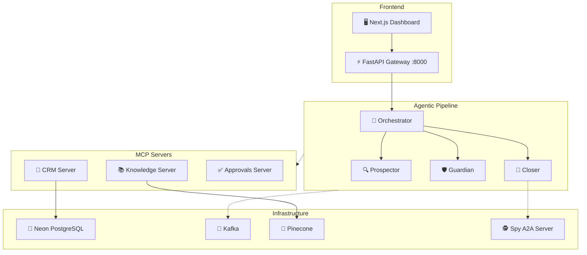

<p align="center">
  
  
  
  
  
  
</p>

# 🚀 OmniSales — The Autonomous Revenue Department

> **A multi-agent AI system that replaces your entire sales software stack with four autonomous, specialized AI agents.**

OmniSales doesn't just store data like a CRM — it **reads** data continuously, **makes decisions** based on real-time signals, **executes** complex workflows, and **self-corrects** based on engagement outcomes. Humans stay in the loop as strategic supervisors, not data-entry operators.

---

## 📋 Table of Contents

- [Why OmniSales?](#-why-omnisales)
- [Architecture Overview](#-architecture-overview)
- [The Agent Workforce](#-the-agent-workforce)
- [Tech Stack](#-tech-stack)
- [Project Structure](#-project-structure)
- [Quick Start](#-quick-start)
- [Environment Variables](#-environment-variables)
- [API Reference](#-api-reference)
- [Demo Scenarios](#-demo-scenarios)
- [Kubernetes & Scaling](#-kubernetes--scaling)
- [Documentation](#-documentation)

---

## ❓ Why OmniSales?

Traditional sales teams spend **80% of their time on information routing** — researching leads, drafting emails, updating CRMs, checking for replies, and following up. These are automatable workflows, not tasks requiring human judgment.

| Problem | What Happens Today | What OmniSales Does |
| :--- | :--- | :--- |
| **Leaked Revenue** | Reps miss follow-ups, deals go to competitors | Closer Agent detects stale deals in real-time |
| **Pipeline Rot** | Deals go cold without anyone noticing | Daily autonomous staleness scans + re-engagement |
| **Customer Churn** | Warning signals buried in usage dashboards | Guardian Agent scores churn risk from multi-signal analysis |
| **Slow Competitive Intel** | Reps learn about competitor changes days late | Spy Agent scrapes + broadcasts battle cards via A2A |
| **Manual Prospecting** | SDRs spend hours researching each lead manually | Prospector Agent enriches, scores, and drafts in seconds |

**Impact:** 50.7% cost reduction · 3.1× revenue multiplier · 84% cheaper customer acquisition · 6.3× better ROI ([see detailed financial model](omnisales_detailed_report.md#11-detailed-financial-impact-model))

---

## 🏗 Architecture Overview

OmniSales is built on a **Three-Protocol Communication Model**:

```
MCP   → Vertical:   Agent talks DOWN to external tools (CRM, Email, RAG)
A2A   → Horizontal: Agent talks ACROSS to other agents (sync intelligence sharing)
Kafka → Async:      Agent BROADCASTS signals to all listeners (event-driven triggers)
```



---

## 🤖 The Agent Workforce

### 🔍 The Prospector — New Customer Acquisition
Researches target companies, enriches contact data, scores leads against ICP criteria using LLM, and drafts hyper-personalized multi-email outreach sequences. All drafts go through human approval before sending.

### 🎯 The Closer — Active Deal Management
Monitors all pipeline deals for staleness and risk signals. When a deal goes silent (e.g., 10 days after pricing discussion), it classifies risk, fetches competitor battle cards from the Spy via **A2A**, retrieves objection-handling docs from **Pinecone RAG**, and drafts a contextual re-engagement email.

### 🛡 The Guardian — Customer Retention & Upsell
Analyzes customer usage metrics, support ticket sentiment, and login frequency to score churn risk (0–1). Flags the highest-risk accounts with tailored retention plays — not generic templates, but strategies specific to each account's situation.

### 🕵 The Spy — Competitive Intelligence (A2A Server)
The only agent that acts as an **A2A server**. Other agents call it on-demand for battle cards, competitor pricing history, and win-back strategies. Exposes skills via the `/.well-known/agent.json` Agent Card.

### 🧠 The Orchestrator — Supervisor & Scheduler
Central supervisor that dispatches work to sub-agents, runs autonomous pipeline scans, and provides a chat interface for sales managers to query system status using natural language.

---

## ⚙ Tech Stack

| Layer | Technology | Purpose |
| :--- | :--- | :--- |
| Agent Framework | **LangGraph 0.2+** | Cyclic graphs, HITL interrupt/resume, state checkpointing |
| LLM (Complex) | **Groq** `llama-3.3-70b-versatile` | Risk classification, objection handling, email drafting |
| LLM (Fast) | **Groq** `llama-3.1-8b-instant` | ICP scoring, data extraction, status checks |
| Backend | **FastAPI** + Python 3.12 | REST API, WebSocket, agent task dispatch |
| Frontend | **Next.js 14** (App Router) | Approval queue, deal pipeline, agent activity feed |
| Database | **Neon PostgreSQL** | CRM state, RLS multi-tenancy, agent audit logs |
| Vector Store | **Pinecone** | RAG for playbooks, battle cards, objection handling |
| Event Bus | **Apache Kafka** | Async inter-agent messaging, event-driven triggers |
| Cache | **Redis 7** | Agent state, rate limiting, WebSocket pub/sub |
| MCP Protocol | **FastMCP** | Modular tool integration (CRM, Knowledge, Approvals) |
| A2A Protocol | **A2A** (Google → LF) | Peer-to-peer agent intelligence sharing |
| Container Orch. | **Kubernetes + KEDA** | Event-driven horizontal autoscaling on Kafka lag |

---

## 📁 Project Structure

```
OmniSales/
├── agents/
│   ├── closer/              # Deal risk detection & re-engagement
│   ├── prospector/           # Lead research & cold outreach
│   ├── guardian/             # Churn prediction & retention
│   ├── orchestrator/         # Central supervisor & scheduler
│   └── spy/                  # A2A competitive intelligence server
│
├── mcp-servers/
│   ├── approvals/            # Human-in-the-loop approval queue
│   ├── crm/                  # Neon PostgreSQL CRM bridge
│   └── knowledge/            # Pinecone RAG search server
│
├── api-gateway/              # FastAPI — REST + WebSocket + auth
│   ├── main.py
│   └── Dockerfile
│
├── dashboard/                # Next.js 14 — approval UI & pipeline view
│   └── src/
│
├── shared/                   # Shared Python library
│   ├── config.py             # Centralized configuration
│   ├── db.py                 # Database pool & helpers
│   ├── events.py             # Kafka event publishing
│   ├── kafka.py              # Kafka consumer/producer
│   ├── llm.py                # Groq LLM with key rotation
│   ├── skills.py             # Prompt engineering packages
│   └── state.py              # LangGraph agent state schema
│
├── db/
│   ├── schema.sql            # PostgreSQL schema + RLS policies
│   └── seed.sql              # Demo dataset (20 accounts, 15 deals)
│
├── k8s/                      # Kubernetes manifests
│   ├── agents/               # Agent deployments + PDBs
│   ├── gateway/              # API gateway deployment
│   ├── keda/                 # KEDA ScaledObject configs
│   ├── mcp/                  # MCP server deployments
│   └── security/             # Istio mTLS + network policies
│
├── scripts/
│   ├── reset_demo.py         # Reset database to clean demo state
│   └── seed_pinecone.py      # Ingest docs into Pinecone
│
├── docker-compose.yml        # Full local development stack
├── .env.example              # Environment variable template
└── requirements.txt          # Python dependencies
```

---

## 🚀 Quick Start

### Prerequisites

- **Docker** & **Docker Compose** v2+
- **Groq API Key** — [Get one free](https://console.groq.com)
- **Neon PostgreSQL** — [Create a free project](https://neon.tech)
- **Pinecone API Key** — [Get a free starter index](https://www.pinecone.io)

### 1. Clone & Configure

```bash
git clone https://github.com/Yugansh5013/OmniSales.git
cd OmniSales

# Copy the env template and fill in your API keys
cp .env.example .env
```

### 2. Set Up the Database

Run the schema and seed data against your Neon PostgreSQL instance:

```bash
psql "$DATABASE_URL" -f db/schema.sql
psql "$DATABASE_URL" -f db/seed.sql
```

### 3. Seed Pinecone (RAG Knowledge Base)

```bash
pip install -r requirements.txt
python scripts/seed_pinecone.py
```

### 4. Launch the Full Stack

```bash
docker compose up --build
```

This starts **12 services**: Redis, Zookeeper, Kafka, 3 MCP Servers, 4 Agents (Closer, Prospector, Guardian, Orchestrator), Spy A2A Server, API Gateway, and the Dashboard.

### 5. Access the Application

| Service | URL |
| :--- | :--- |
| 🖥 **Dashboard** | [http://localhost:3000](http://localhost:3000) |
| 📡 **API Docs** (Swagger) | [http://localhost:8000/docs](http://localhost:8000/docs) |
| 🧠 **Orchestrator** | http://localhost:9004 |
| 🎯 **Closer Agent** | http://localhost:9001 |
| 🔍 **Prospector Agent** | http://localhost:9002 |
| 🛡 **Guardian Agent** | http://localhost:9003 |
| 🕵 **Spy A2A Server** | http://localhost:8080 |

---

## 🔑 Environment Variables

Copy `.env.example` to `.env` and configure:

| Variable | Required | Description |
| :--- | :---: | :--- |
| `GROQ_API_KEYS` | ✅ | Comma-separated Groq API keys (rotation pool) |
| `DATABASE_URL` | ✅ | Neon PostgreSQL connection string |
| `PINECONE_API_KEY` | ✅ | Pinecone vector database key |
| `PINECONE_INDEX` | ✅ | Pinecone index name (default: `omnisales-knowledge`) |
| `OPENAI_API_KEY` | ✅ | For embedding generation (Pinecone ingestion) |
| `KAFKA_BROKERS` | ⬜ | Auto-configured by Docker Compose |
| `REDIS_URL` | ⬜ | Auto-configured by Docker Compose |
| `LANGSMITH_API_KEY` | ⬜ | Optional — LLM tracing & observability |
| `JWT_SECRET` | ⬜ | API authentication secret |

---

## 📡 API Reference

### Agent Triggers

| Method | Endpoint | Description |
| :--- | :--- | :--- |
| `POST` | `/api/deals/{deal_id}/trigger` | Trigger Closer agent on a specific deal |
| `POST` | `/api/prospector/trigger` | Trigger Prospector on a target company |
| `POST` | `/api/guardian/trigger` | Trigger Guardian churn analysis |
| `POST` | `/api/orchestrator/scan` | Run full autonomous pipeline scan |
| `POST` | `/api/orchestrator/chat` | Chat with the Orchestrator |

### Approval Queue

| Method | Endpoint | Description |
| :--- | :--- | :--- |
| `GET` | `/api/tasks/pending` | List tasks awaiting approval |
| `POST` | `/api/tasks/{id}/approve` | Approve an agent-drafted action |
| `POST` | `/api/tasks/{id}/reject` | Reject with optional feedback |

### Data

| Method | Endpoint | Description |
| :--- | :--- | :--- |
| `GET` | `/api/deals` | List all deals with risk classification |
| `GET` | `/api/deals/{id}` | Deal details + audit trail |
| `GET` | `/api/accounts` | List all customer accounts |
| `GET` | `/api/leads` | List all leads with ICP scores |
| `WS` | `/ws/live` | WebSocket for real-time events |

---

## 🎬 Demo Scenarios

The system covers all **3 mandatory Track 4 scenarios** with 5+ autonomous steps each:

### Scenario 1 — Deal Risk Alert (Closer)
> A $120K deal goes silent for 10 days after a pricing discussion.

The Closer detects the staleness → classifies risk via LLM → fetches competitor battle cards from Spy (A2A) → retrieves objection-handling docs from Pinecone (RAG) → drafts a re-engagement email → pauses for human approval → sends on approval.

```bash
curl -X POST http://localhost:8000/api/deals/deal_4821/trigger
```

### Scenario 2 — Cold Outreach (Prospector)
> Research a target company and draft personalized 3-email sequences for 2 decision-makers.

The Prospector enriches company data → scores ICP (0.87, Tier A) → identifies VP Sales + CRO → drafts tailored sequences per persona → queues for human approval.

```bash
curl -X POST http://localhost:8000/api/prospector/trigger \
  -H "Content-Type: application/json" \
  -d '{"company": "Acme Corp", "vertical": "Fintech"}'
```

### Scenario 3 — Churn Prediction (Guardian)
> Flag top 3 churn risks from 20 accounts with tailored retention plays.

The Guardian loads all accounts → scores churn risk (0–1) → ranks top 3 → generates specific retention strategies per account → queues for CS manager approval.

```bash
curl -X POST http://localhost:8000/api/guardian/trigger
```

---

## ☸ Kubernetes & Scaling

Production-ready K8s manifests are in `k8s/`. The system uses **KEDA** for event-driven autoscaling based on Kafka consumer lag (not CPU — the correct signal for I/O-bound LLM agents).

| Workload | Min → Max Pods | Scale Trigger |
| :--- | :---: | :--- |
| Closer Agent | 2 → 10 | Kafka lag > 20 messages |
| Prospector Agent | 1 → 12 | Kafka lag > 30 messages |
| Guardian Agent | 1 → 8 | Kafka lag > 25 messages |
| Spy Agent | 0 → 5 | Kafka lag + cron |
| API Gateway | 2 → 8 | CPU ≥ 70% |

Key features:
- **Namespace isolation** — agents, MCP servers, gateway, and data in separate namespaces
- **Istio mTLS (STRICT)** — zero-trust encrypted service-to-service communication
- **PodDisruptionBudgets** — minimum availability during rolling updates
- **HashiCorp Vault** — dynamic secret injection for API keys
- **ArgoCD** — GitOps declarative deployments

---

## 📚 Documentation

| Document | Description |
| :--- | :--- |
| [`omnisales_detailed_report.md`](omnisales_detailed_report.md) | Full technical architecture, financial impact model (INR), innovation analysis, and scaling strategy |
| [`project_des.md`](project_des.md) | Complete engineering blueprint with code examples and Kubernetes manifests |
| [`OmniSales_Detailed_Report.pdf`](OmniSales_Detailed_Report.pdf) | PDF version with rendered architecture flowcharts |
| [`db/schema.sql`](db/schema.sql) | PostgreSQL schema with RLS policies |
| [`db/seed.sql`](db/seed.sql) | Demo dataset (20 accounts, 15 deals, 5 prospects) |
| [`.env.example`](.env.example) | Environment variable reference |

---

## 🏆 Key Differentiators

- **Not a CRM add-on** — a complete autonomous revenue system
- **Three-protocol architecture** (MCP + A2A + Kafka) — never done before in sales tech
- **Human-in-the-Loop at 3 layers** — LangGraph interrupt, MCP approval server, and database constraint
- **Event-driven scaling** — KEDA on Kafka lag, not CPU (correct signal for LLM agents)
- **Zero vendor lock-in** — swap any tool by changing an MCP server URL, zero agent code changes

---

<p align="center">
  <strong>Built with ❤️ for the ET GenAI Hackathon</strong><br/>
  <em>LangGraph · MCP · A2A · Kafka · Kubernetes · Groq</em>
</p>
