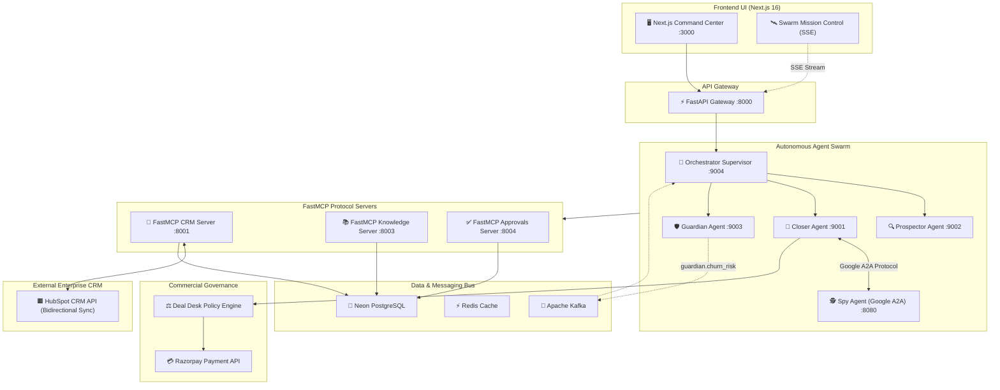

<p align="center">
  
  
  
  
  
  
  
</p>

# 🚀 OmniSales — The Autonomous Revenue Department

> **An enterprise multi-agent AI system that unifies B2B prospecting, stalled deal closing, customer retention, competitive intelligence, and commercial policy governance into a human-governed autonomous pipeline.**

OmniSales doesn't just store data like a passive CRM — it **scans telemetry continuously**, **reasons across multi-agent swarms**, **executes** objection handling and outreach, and **enforces commercial policies** before issuing **Razorpay payment links**. Sales reps stay in the loop as strategic supervisors with full draft-editing and approval controls.

---

## 📋 Table of Contents

- [Why OmniSales?](#-why-omnisales)
- [Architecture & Communication Protocols](#-architecture--communication-protocols)
- [The Autonomous Agent Swarm](#-the-autonomous-agent-swarm)
- [Deal Desk & Razorpay Governance](#-deal-desk--razorpay-governance)
- [Real-Time Swarm Mission Control](#-real-time-swarm-mission-control)
- [Human-in-the-Loop & Live Email Reply Loop](#-human-in-the-loop--live-email-reply-loop)
- [Evals, Reliability & LangSmith Tracing](#-evals-reliability--langsmith-tracing)
- [Tech Stack](#-tech-stack)
- [Quick Start](#-quick-start)
- [Documentation](#-documentation)

---

## ❓ Why OmniSales?

Traditional B2B sales teams spend **80% of their working hours on manual routing and administrative overhead** — searching company firmographics, drafting repetitive follow-ups, monitoring deal silence, and updating disconnected dashboards.

| Revenue Leak | Traditional CRM Problem | OmniSales Autonomous Solution |
| :--- | :--- | :--- |
| **Pipeline Rot & Stalled Deals** | Deals go cold after objections without follow-up | **Closer Agent** detects stall duration, fetches competitor intel via A2A, and drafts counter-objection responses |
| **Manual Prospecting & SDR Fatigue** | SDRs spend hours researching leads manually | **Prospector Agent** enriches firmographics, scores ICP fit, and crafts multi-persona sequences |
| **Silent Customer Churn** | P1 tickets and usage drops hide in telemetry | **Guardian Agent** scores predictive churn risk and formulates 30-day executive alignment playbooks |
| **Stale Competitive Battlecards** | Battlecards stored in static slide decks | **Spy Agent** fetches live competitor pricing, strengths, and weaknesses via Google A2A protocol |
| **Unauthorized Discounting** | Reps offer unapproved 50%+ discounts | **Deal Desk Engine** enforces commercial policies and generates compliant Razorpay payment links |

---

## 🏗 Architecture & Communication Protocols

OmniSales operates across a **Three-Protocol Communication Model**:

```
MCP (Vertical)   → Agent queries tools downwards (FastMCP CRM, Knowledge RAG, Approvals DB)
A2A (Horizontal) → Closer queries Spy Agent across services via Google Agent-to-Agent standard
Kafka (Async)    → Event-driven broadcasting (Guardian churn signals consumed by Orchestrator)
SSE (Real-Time)  → Server-Sent Events stream live microsecond telemetry to Swarm Mission Control
CRM Sync (Live)  → Bidirectional sync with HubSpot CRM (Deals, Leads, Contacts, Pipeline Stages)
```


```mermaid
flowchart TD
    subgraph Frontend ["Frontend UI (Next.js 16)"]
        UI["🖥 Next.js Command Center :3000"]
        MC["🛰️ Swarm Mission Control (SSE)"]
    end

    subgraph Gateway ["API Gateway"]
        GW["⚡ FastAPI Gateway :8000"]
    end

    subgraph Agents ["Autonomous Agent Swarm"]
        ORC["🧠 Orchestrator Supervisor :9004"]
        PR["🔍 Prospector Agent :9002"]
        CL["🎯 Closer Agent :9001"]
        GR["🛡️ Guardian Agent :9003"]
        SPY["🕵️ Spy Agent (Google A2A) :8080"]
    end

    subgraph Governance ["Commercial Governance"]
        DD["⚖️ Deal Desk Policy Engine"]
        RZ["💳 Razorpay Payment API"]
    end

    subgraph MCP ["FastMCP Protocol Servers"]
        CRM["💾 FastMCP CRM Server :8001"] 
        KNW["📚 FastMCP Knowledge Server :8003"]
        APR["✅ FastMCP Approvals Server :8004"]
    end

    subgraph External ["External Enterprise CRM"]
        HS["🟧 HubSpot CRM API (Bidirectional Sync)"]
    end

    subgraph Storage ["Data & Messaging Bus"]
        NEON["🐘 Neon PostgreSQL"]
        REDIS["⚡ Redis Cache"]
        KFK["🚂 Apache Kafka"]
    end

    UI --> GW
    MC -.->|SSE Stream| GW
    GW --> ORC
    ORC --> PR
    ORC --> CL
    ORC --> GR
    CL <-->|Google A2A Protocol| SPY
    CL --> DD
    DD --> RZ
    Agents --> MCP
    CRM <--> HS
    CRM --> NEON
    KNW --> NEON
    APR --> NEON
    GR -.->|guardian.churn_risk| KFK
    KFK -.-> ORC
```

---

## 🤖 The Autonomous Agent Swarm

### 🔍 1. The Prospector (`:9002`)
- **Mission**: Ingests new leads, enriches tech stack and funding signals, computes multi-dimensional ICP scores (0.00–1.00), identifies executive buyer personas, and drafts personalized multi-touch outreach sequences.
- **Workflow**: `research_company` → `enrich_lead` → `score_icp` → `identify_contacts` → `draft_sequences`.

### 🎯 2. The Closer (`:9001`)
- **Mission**: Monitors active negotiation deals. Detects stall conditions (e.g. 7+ days silence after pricing) and buyer competitor objections.
- **A2A Intelligence**: Queries the **Spy Agent via Google A2A protocol** to pull real-time competitor battlecards, synthesizes counter-arguments highlighting enterprise compliance, and drafts re-engagement messages.
- **Workflow**: `analyze_deal` → `classify_risk` → `query_spy_a2a` → `handle_objection` → `draft_followup`.

### 🛡️ 3. The Guardian (`:9003`)
- **Mission**: Scans customer account telemetry (API volume drops, login frequencies, open P1 tickets) to score predictive churn risk (0.00–1.00). Formulates bespoke 30-day retention action plans and executive briefing playbooks.
- **Workflow**: `analyze_accounts` → `score_churn` → `rank_and_flag` → `generate_retention_playbook`.

### 🕵️ 4. The Spy Agent (`:8080`)
- **Mission**: Standalone competitive intelligence agent exposing **Google A2A-compliant endpoints** (`get_battlecard`, `get_winback_strategy`, `get_competitor_usage`). Synthesizes live market differentiators, pricing weaknesses, and win-back tactics.

---

## ⚖️ Deal Desk & Razorpay Governance

OmniSales includes a deterministic **Commercial Governance Engine** (`shared/deal_policy.py`) that acts as a hard security boundary before generating billing invoices:

1. **Commercial Policy Rules**:
   - **Discount Threshold**: Max 20% discount (deals with >20% discount require VP approval override).
   - **Contract Minimum**: Minimum 12-month commitment.
   - **Payment Terms**: Net 30 standard.
2. **Deterministic Violation Handling**:
   - If a deal violates policy (e.g. 55% discount requested), Deal Desk blocks the checkout, logs the violation reason, and **generates an automated, policy-compliant counter-proposal**.
3. **Razorpay Payment Link**:
   - For cleared deals or authorized manager overrides, OmniSales invokes Razorpay's API to generate a real payment link with transaction tracking and audit logging.
4. **Adversarial Hardening**:
   - 100% block rate across 17/17 adversarial prompt-injection and commercial violation test cases (`tests/test_deal_desk_adversarial.py`).

---

## 🛰️ Real-Time Swarm Mission Control

When clicking **"Scan CRM"** in the top navigation or overview dashboard:
- A glassmorphic command drawer slides out and establishes a **Server-Sent Events (SSE) stream** (`GET /api/orchestrator/scan/stream`).
- **Parallel Async Execution**: Runs all 3 subagent sweeps concurrently via `asyncio.gather` and an `asyncio.Queue`.
- **Active Target Spotlight**: Highlights the exact entity currently under analysis with an animated laser scanning beam.
- **Live Telemetry Counters**: Live counters for tokens streamed, signals detected, and tasks queued ticking up dynamically.
- **One-Click Review**: Instant transition to the Human Approvals Queue once the sweep completes.

---

## ✉️ Human-in-the-Loop & Live Email Reply Loop

1. **Human-in-the-Loop (HITL) Gate**: Every AI-generated outreach sequence, re-engagement draft, and retention playbook drops into `/dashboard/approvals`.
2. **Rep-Editable Draft Modal**: Sales reps can edit subject lines and email body text before approving.
3. **Real Email Dispatch via Resend**: Outbound emails are sent with clean HTML formatting and a hidden `[ref:xxxxxxxx]` deal tracking tag.
4. **Autonomous Inbound Reply Poller**: A background IMAP poller checks the inbox, extracts the deal reference tag, appends the buyer's reply to `deals.closer_thread`, and automatically re-triggers the Closer Agent for the next turn of negotiation!

---

## 🧪 Evals, Reliability & LangSmith Tracing

OmniSales includes a comprehensive automated evaluation and reliability framework:
- **OpenEvals Golden-Set Benchmark**: 65 labeled scenarios across Closer (`evals/eval_closer.py`), Guardian (`evals/eval_guardian.py`), and Prospector (`evals/eval_prospector.py`).
- **RAG Faithfulness & Retrieval Relevance**: Groundedness checks evaluated via OpenEvals prompt evaluators (`evals/eval_rag_faithfulness.py`).
- **Consolidated Master Runner**: `python evals/run_all_evals.py` producing `evals/eval_report.json`.
- **Live Reliability Scorecard**: Real-time approval rates, token usage metrics, cost analysis, and model distribution (`/dashboard/evals`).
- **LangSmith Tracing**: Full execution tracing enabled via `LANGSMITH_API_KEY` with deep LangGraph run trees.

---

## 💻 Tech Stack

| Layer | Technologies |
| :--- | :--- |
| **Agent Framework** | LangGraph 0.2+, LangChain, Python 3.12 |
| **LLM Runtime** | Groq (`openai/gpt-oss-120b` for complex reasoning, `openai/gpt-oss-20b` for fast scoring) |
| **Tool Integration** | FastMCP Protocol (Model Context Protocol) |
| **Agent Communication** | Google A2A Protocol (Agent-to-Agent HTTP spec) |
| **Commercial Billing** | Razorpay Payments API |
| **Email Infrastructure** | Resend API (Outbound) + IMAP Polling Worker (Inbound) |
| **Event Bus & Cache** | Apache Kafka, ZooKeeper, Redis 7 |
| **Database** | Neon Cloud PostgreSQL (`asyncpg`) |
| **Evaluation Suite** | OpenEvals, LangSmith |
| **Frontend UI** | Next.js 16 (App Router, Turbopack, Tailwind CSS, Lucide Icons) |
| **Orchestration** | Docker Compose, Kubernetes, KEDA |

---

## ⚡ Quick Start

### Prerequisites
- Docker & Docker Desktop installed
- Python 3.10+ & Node.js 20+ (for local scripts/development)

### 1. Clone & Configure Environment
```bash
git clone https://github.com/Yugansh5013/OmniSales.git
cd OmniSales
cp .env.example .env
```
Fill in your API keys in `.env`:
- `GROQ_API_KEY`: Groq Cloud API key (dual-model: `openai/gpt-oss-120b` & `openai/gpt-oss-20b`)
- `DATABASE_URL`: Neon PostgreSQL connection string
- `RAZORPAY_KEY_ID` & `RAZORPAY_KEY_SECRET`: Razorpay test keys (Commercial Governance)
- `RESEND_API_KEY`: Resend email API key (Real outbound email dispatch)
- `HUBSPOT_ACCESS_TOKEN` & `HUBSPOT_PORTAL_ID`: (Optional) HubSpot CRM Private App Token for live bidirectional CRM sync
- `LANGSMITH_API_KEY`: (Optional) LangSmith tracing key

### 2. Start the Complete Stack
```bash
docker compose up -d
```
All 14 microservices will build and launch:
- 🌐 Next.js Dashboard: [`http://localhost:3000`](http://localhost:3000)
- ⚡ FastAPI Gateway: [`http://localhost:8000`](http://localhost:8000)
- 💾 FastMCP CRM Server: `http://localhost:8001`
- 📚 FastMCP Knowledge Server: `http://localhost:8003`
- ✅ FastMCP Approvals Server: `http://localhost:8004`
- 🕵️ Spy A2A Agent: `http://localhost:8080`
- 🎯 Closer Agent: `http://localhost:9001`
- 🔍 Prospector Agent: `http://localhost:9002`
- 🛡️ Guardian Agent: `http://localhost:9003`
- 🧠 Orchestrator Supervisor: `http://localhost:9004`

### 3. Run Automated E2E Tests & Evals
```bash
# Run comprehensive 43-step end-to-end integration test suite
python tests/e2e_test.py

# Run Deal Desk adversarial test suite (17/17 security cases)
python tests/test_deal_desk_adversarial.py

# Run full 65-scenario OpenEvals reliability benchmark
python evals/run_all_evals.py
```

---

## 📚 Documentation

Comprehensive architectural, operational, and integration guides are available in the [`docs/`](docs/) directory:

- **[System Architecture & Tri-Protocol Specification](docs/README.md)**: Master documentation hub.
- **[Autonomous Agent Swarm](docs/agents/README.md)**: Deep dives on [Closer](docs/agents/closer.md), [Prospector](docs/agents/prospector.md), [Guardian](docs/agents/guardian.md), [Spy](docs/agents/spy.md), and [Orchestrator](docs/agents/orchestrator.md).
- **[API Gateway & Inbound Reply Poller](docs/api-gateway/README.md)**: REST routing, IMAP watchers, and HubSpot sync.
- **[FastMCP Protocol Servers](docs/mcp-servers/README.md)**: [CRM & HubSpot Sync](docs/mcp-servers/crm.md), [Pinecone Knowledge RAG](docs/mcp-servers/knowledge.md), and [HITL Approvals](docs/mcp-servers/approvals.md).
- **[Next.js 16 Dashboard](docs/dashboard/README.md)**: Modern UI architecture, components, and real-time SSE stream.
- **[Commercial Governance & Shared Kernel](docs/shared/README.md)**: Deal Desk policy engine, Razorpay billing, and Groq LLM routing.
- **[Evals & Reliability Benchmark](docs/evals/README.md)**: OpenEvals 65-scenario suite, LangSmith tracing, and cost tracking.
- **[Distributed Cloud & Kubernetes Scaling](docs/scaling_and_infrastructure.md)**: Enterprise production scaling topology.

