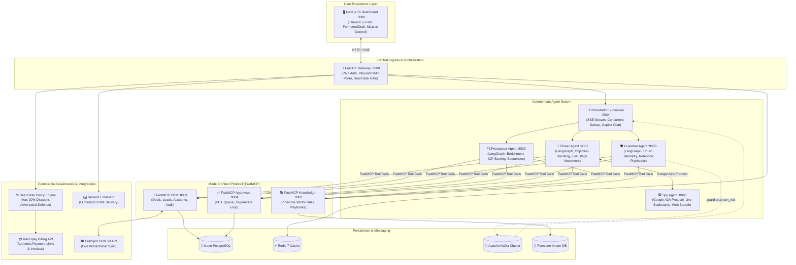

# 📚 OmniSales Documentation Hub

Welcome to the **OmniSales Engineering & Architecture Documentation Hub**. This directory provides comprehensive technical reference guides for every subsystem, protocol layer, and governance engine in the repository.

---

## 🏗️ System Architecture Blueprint

---

## 📑 Core Documentation Index

| Subsystem / Module | Documentation Path | Key Topics Covered |
| :--- | :--- | :--- |
| **Autonomous Agent Swarm** | [`agents/README.md`](agents/README.md) | Multi-agent design philosophy, Tri-Protocol Communication, LangGraph state persistence. |
| ↳ **Closer Agent** | [`agents/closer.md`](agents/closer.md) | Stalled deal classification, A2A battlecards, objection handling, and live CRM stage movement. |
| ↳ **Prospector Agent** | [`agents/prospector.md`](agents/prospector.md) | Firmographic enrichment, Tier A–D ICP scoring algorithm, and personalized 3-touch cadences. |
| ↳ **Guardian Agent** | [`agents/guardian.md`](agents/guardian.md) | Usage telemetry ingest, predictive churn risk formula, Kafka events, and 30-day retention playbooks. |
| ↳ **Spy Agent** | [`agents/spy.md`](agents/spy.md) | Google A2A protocol specification (`/.well-known/agent.json`), Tavily live search, and battlecards. |
| ↳ **Orchestrator Agent** | [`agents/orchestrator.md`](agents/orchestrator.md) | Parallel swarm supervisor, Server-Sent Events (SSE) Mission Control streaming, and copilot chat. |
| **API Gateway** | [`api-gateway/README.md`](api-gateway/README.md) | Reverse proxy, background IMAP reply watcher, HubSpot CRM auto-sync loop, and route index. |
| **FastMCP Servers** | [`mcp-servers/README.md`](mcp-servers/README.md) | FastMCP architecture, tool discovery, decoupled integration, and isolation benefits. |
| ↳ **CRM Server & HubSpot Sync** | [`mcp-servers/crm.md`](mcp-servers/crm.md) | FastMCP CRM tools, database queries, and live bidirectional HubSpot CRM synchronization. |
| ↳ **Knowledge Server & RAG** | [`mcp-servers/knowledge.md`](mcp-servers/knowledge.md) | Pinecone vector search, embeddings, objection playbooks, and safe fallback tagging. |
| ↳ **Approvals Server & HITL** | [`mcp-servers/approvals.md`](mcp-servers/approvals.md) | Human-in-the-Loop task lifecycle, dual-mode editing, feedback incorporation, and regeneration. |
| **Next.js 16 Dashboard** | [`dashboard/README.md`](dashboard/README.md) | App Router frontend, design system, component catalog, FormattedDraft, and pages walkthrough. |
| **Shared Kernel & Governance** | [`shared/README.md`](shared/README.md) | Deal Desk policy engine, Razorpay billing, HubSpot client, Resend email dispatch, and Groq dual-model LLM routing. |
| **Evals & Reliability** | [`evals/README.md`](evals/README.md) | OpenEvals 65-scenario benchmark, Golden Sets, RAG faithfulness, LangSmith tracing, and token cost tracking. |
| **Enterprise Cloud Scaling** | [`scaling_and_infrastructure.md`](scaling_and_infrastructure.md) | Distributed Kubernetes topology, KEDA event-driven autoscaling, and cloud resilience. |

---

## 🧭 Navigation by Role

- **For Judges & Evaluators**:
  Start with the [System Architecture Blueprint](#️-system-architecture-blueprint) above, review the [Evals & Reliability Guide](evals/README.md) to inspect our 65-scenario benchmarks, and explore the [Shared Governance & Deal Desk](shared/README.md) engine to see how authentic Razorpay billing links are enforced.
- **For AI Engineers**:
  Read the [Autonomous Agent Swarm Overview](agents/README.md), followed by the deep dives for [Closer](agents/closer.md), [Prospector](agents/prospector.md), [Guardian](agents/guardian.md), and [Spy](agents/spy.md).
- **For Full-Stack & Frontend Developers**:
  Explore the [Next.js Dashboard Guide](dashboard/README.md) and the [API Gateway Reference](api-gateway/README.md).
- **For DevOps & Infrastructure Engineers**:
  Review the [Enterprise Cloud Scaling Specification](scaling_and_infrastructure.md) and [FastMCP Server Architecture](mcp-servers/README.md).
