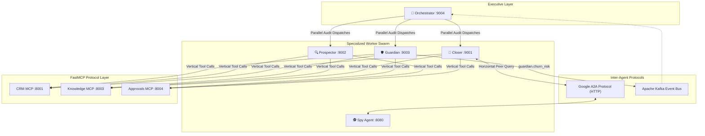

# 🤖 Autonomous Agent Swarm

OmniSales is powered by a coordinated multi-agent workforce designed to replace fragmented B2B sales tooling with autonomous, specialized workers. Rather than relying on a single monolithic LLM prompt, OmniSales decomposes revenue operations into discrete specialized agents that communicate across standard networking protocols.

---

## 1. The Autonomous Workforce

| Agent | Service Port | Framework | Primary Responsibilities |
| :--- | :---: | :--- | :--- |
| **[🎯 Closer Agent](closer.md)** | `:9001` | LangGraph 0.2+ | Stalled deal acceleration, objection handling, live stage advancement, and Razorpay checkout generation |
| **[🔍 Prospector Agent](prospector.md)** | `:9002` | LangGraph 0.2+ | Inbound/outbound lead enrichment, ICP scoring (Tier A–D), persona identification, and multi-touch sequence drafting |
| **[🛡️ Guardian Agent](guardian.md)** | `:9003` | LangGraph 0.2+ | Customer telemetry audit, predictive churn risk scoring, Kafka broadcasting, and 30-day executive retention playbooks |
| **[🕵️ Spy Agent](spy.md)** | `:8080` | Google A2A / FastAPI | Competitive battlecards, live web search synthesis, pricing vulnerability detection, and win-back tactics |
| **[🧠 Orchestrator Agent](orchestrator.md)** | `:9004` | FastAPI / AsyncIO | Parallel swarm supervisor, Server-Sent Events (SSE) Mission Control streaming, and conversational executive copilot |

---

## 2. Tri-Protocol Communication Architecture

OmniSales avoids proprietary agent coordination frameworks by adopting an open **Three-Protocol Communication Model**:

```
MCP (Vertical)   → Downward integration into tools and data stores (CRM, Knowledge, Approvals)
A2A (Horizontal) → Peer-to-peer intelligence exchange between running agent services (Closer ↔ Spy)
Kafka (Async)    → Event-driven broadcasting of portfolio-level alerts across services
```



---

## 3. Core Architectural Principles

1. **State Persistence & Rehydration**:
   Agents use LangGraph's cyclic state graphs with PostgreSQL checkpointers (`PostgresSaver`). Graph state is persisted at each reasoning step, allowing long-running deals to pause for human input and rehydrate without memory loss.
2. **Deterministic Guardrails**:
   Probabilistic LLM outputs are strictly validated by deterministic code before external execution. Discounts, payment terms, and contract lengths must satisfy the [Deal Desk Policy Engine](../shared/README.md) before any payment link is issued.
3. **Strict Human-in-the-Loop (HITL)**:
   No email or retention play leaves the system autonomously. All drafts drop into the centralized Human Approvals queue (`/dashboard/approvals`) where sales reps retain full editorial control (Write / Preview mode).
4. **Token-Level Observability**:
   Every LLM completion extracts `usage_metadata` to track token consumption and financial inference costs down to the fractions of a cent per decision.
