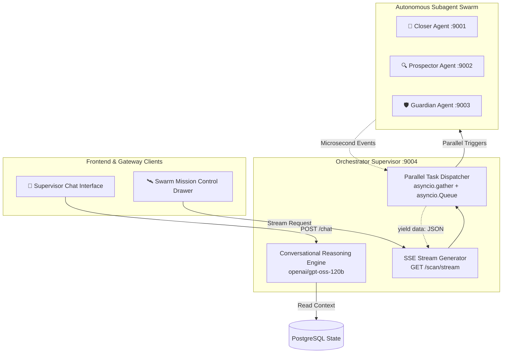

# 🧠 Orchestrator Supervisor Agent

The **Orchestrator Agent** (`:9004`) serves as the central executive coordinator of the OmniSales multi-agent swarm. It dispatches concurrent audits across subagents, powers the real-time **Server-Sent Events (SSE) Swarm Mission Control**, and provides a conversational supervisor chat interface capable of querying platform telemetry and issuing direct action commands.

---

## 1. Architectural Overview



---

## 2. Server-Sent Events (SSE) Mission Control Stream

When a user clicks **"Scan CRM"** in the navigation header or dashboard overview, the frontend connects to:
`GET /api/orchestrator/scan/stream` (proxied to Orchestrator `:9004/scan/stream`).

### Parallel Concurrent Execution
Rather than scanning leads, deals, and accounts sequentially, the Orchestrator launches all subagent evaluations concurrently using `asyncio.gather` while piping granular execution progress into an `asyncio.Queue`:

1. **Prospector Sweep**: Concurrently evaluates all uncontacted leads (`POST /batch`).
2. **Closer Sweep**: Concurrently scans all active deals for stall duration and objections (`POST /trigger/{id}`).
3. **Guardian Sweep**: Scans all customer accounts in a single batch pass (`POST /analyze`).

### Live Event Telemetry Protocol
The SSE generator streams structured JSON frames that power the frontend visual animations:

```json
data: {
  "type": "target_active",
  "agent": "closer",
  "target_name": "NexGen Robotics",
  "detail": "Analyzing 10-day silence and competitor objection..."
}
```

```json
data: {
  "type": "metrics_tick",
  "tokens_streamed": 1420,
  "signals_detected": 4,
  "tasks_queued": 2
}
```

```json
data: {
  "type": "scan_complete",
  "summary": "Audited 3 leads, 4 deals, and 5 accounts. 5 tasks queued for human approval."
}
```

---

## 3. Conversational Supervisor Interface (`/chat`)

The Orchestrator provides a contextual conversational interface (`POST /chat`) that acts as a strategic co-pilot for sales leaders:

- **Context Injection**: On every prompt, the Orchestrator dynamically loads active ARR numbers, flagged churn risks, pending approval counts, and stalled deal names directly into its system prompt.
- **Natural Language Capabilities**:
  - *"Which deals are currently stalled over competitor pricing?"*
  - *"Why was CloudMatrix Corp flagged for churn?"*
  - *"What is our total at-risk pipeline this quarter?"*
- **Action Dispatch**: The chat engine can directly trigger subagents or initiate portfolio re-scans via tool calls.

---

## 4. Endpoints & API Reference

| Method | Endpoint | Description |
| :--- | :--- | :--- |
| `POST` | `/scan` | Executes synchronous portfolio-wide swarm audit |
| `GET` | `/scan/stream` | Streams real-time Server-Sent Events (SSE) telemetry for Mission Control |
| `POST` | `/chat` | Conversational sales copilot interface with live CRM context injection |
| `GET` | `/health` | Lightweight service health probe |
| `GET` | `/.well-known/agent.json` | Google A2A Agent Card specification metadata |
