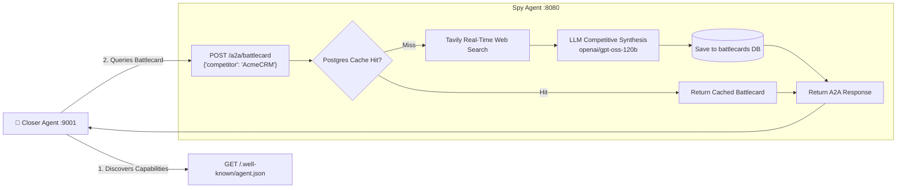

# 🕵️ Spy Agent

The **Spy Agent** (`:8080`) is a standalone competitive intelligence service exposing standard **Google Agent-to-Agent (A2A)** protocol endpoints. It acts as an on-demand market intelligence provider for the Closer Agent and human sales reps, synthesizing live competitor strengths, pricing vulnerabilities, and win-back strategies through real-time web search and structured LLM extraction.

---

## 1. Architectural Overview & Google A2A Protocol

The Spy Agent conforms strictly to the **Google Agent-to-Agent (A2A) HTTP standard**, allowing peer agents across the network to discover its capabilities via a standardized agent card and invoke its intelligence mid-workflow without shared databases or proprietary SDKs.



---

## 2. A2A Agent Card Discovery

The agent exposes its formal capability metadata at `GET /.well-known/agent.json`:

```json
{
  "name": "Spy Agent",
  "description": "Autonomous competitive intelligence agent providing real-time battlecards, pricing analysis, and winback strategies.",
  "version": "2.0.0",
  "protocol": "google-a2a/v1",
  "skills": [
    {
      "id": "get_battlecard",
      "name": "Competitive Battlecard Generator",
      "endpoint": "/a2a/battlecard",
      "method": "POST",
      "input_schema": {
        "type": "object",
        "properties": {
          "competitor": { "type": "string" },
          "product_category": { "type": "string" }
        },
        "required": ["competitor"]
      }
    },
    {
      "id": "get_winback_strategy",
      "name": "Winback Strategy Generator",
      "endpoint": "/a2a/winback",
      "method": "POST",
      "input_schema": {
        "type": "object",
        "properties": {
          "competitor": { "type": "string" },
          "lost_reason": { "type": "string" }
        },
        "required": ["competitor"]
      }
    }
  ]
}
```

---

## 3. Real-Time Intelligence Pipeline

When a peer agent requests a battlecard:
1. **Cache Lookup**: Checks the `battlecards` table in PostgreSQL for recent entries (<7 days old) matching the requested competitor.
2. **Live Web Search**: If un-cached or stale, triggers Tavily API search with targeted queries (e.g., `"{competitor} pricing weaknesses enterprise B2B complaints"`).
3. **Structured Synthesis**: Runs `shared.llm.COMPLEX_LLM` (`openai/gpt-oss-120b`) to produce structured fields:
   - **Key Differentiators**: Where OmniSales structurally wins (e.g., deterministic commercial governance, sub-second Groq inference).
   - **Competitor Weaknesses**: Verifiable pain points (e.g., hidden integration fees, high API latency, lack of native payment links).
   - **Pricing Comparison**: Typical licensing tiers and discounting patterns.
   - **Migration Subsidies & Tactics**: Actionable incentives reps can offer to de-risk switching.
4. **Persistence**: Saves the enriched record to PostgreSQL so subsequent queries return in sub-millisecond response times.

---

## 4. Endpoints & API Reference

| Method | Endpoint | Description |
| :--- | :--- | :--- |
| `POST` | `/a2a/battlecard` | Generates or fetches structured competitor battlecard via A2A protocol |
| `POST` | `/a2a/winback` | Formulates targeted winback strategies for accounts evaluating alternatives |
| `GET` | `/.well-known/agent.json` | Public A2A capability discovery specification |
| `GET` | `/health` | Lightweight service health probe |
