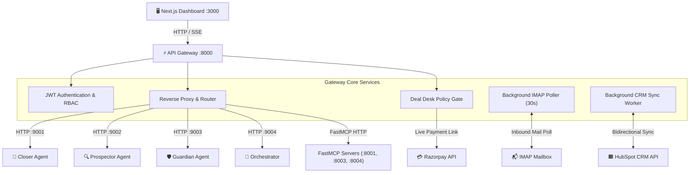

# ⚡ API Gateway Service

The **API Gateway** (`:8000`) is the central ingress and orchestration hub for OmniSales. Built on FastAPI, it unifies authentication, proxies requests to the autonomous agent swarm and MCP servers, runs background synchronization loops with HubSpot CRM and IMAP inboxes, enforces commercial Deal Desk policies, and streams real-time Server-Sent Events (SSE) to the Next.js dashboard.

---

## 1. Architectural Role



---

## 2. Key Subsystems & Background Workers

### 1. Inbound Email Reaction Loop (`_poll_inbound_replies`)
- Runs continuously in the background every 30 seconds.
- Connects via IMAP to the configured sales mailbox (`GMAIL_IMAP_USER`).
- Matches replies using regex against the outbound tracking tag: `r"\[ref:([0-9a-fA-F]{8})\]"`.
- Appends the prospect's message to the deal's `closer_thread` in PostgreSQL.
- Immediately invokes the Closer Agent (`POST http://closer-agent:9001/trigger/{deal_id}`) so the agent autonomously generates a counter-reply to the buyer's response!

### 2. Live HubSpot Inbound Sync Engine (`sync_hubspot_to_db`)
- Pulls live contacts and deals from the HubSpot CRM v3 REST API.
- Synchronizes contact name, email, company, job title, and lifecycle stage into the local PostgreSQL `leads` and `deals` tables.
- Establishes associations between companies, contacts, and deals.

### 3. Deal Desk & Razorpay Checkout Gate
- `POST /api/deals/{id}/payment-link`:
  - Intercepts proposed payment link requests.
  - Passes parameters (`discount_pct`, `payment_terms`, `contract_months`) to `shared.deal_policy.evaluate_deal_policy`.
  - If a violation occurs (e.g., 55% discount requested), responds with **HTTP 422 Unprocessable Entity** and provides a mathematically sound, compliant counter-proposal.
  - If compliant or approved via manager override, generates an authentic Razorpay checkout link and registers an audit trail record.

### 4. Swarm Mission Control SSE Proxy
- `GET /api/orchestrator/scan/stream`:
  - Proxies the Server-Sent Events stream from Orchestrator (`:9004/scan/stream`) directly to the browser.
  - Emits microsecond-level telemetry frames for active target highlighting and counter animations.

---

## 3. Core REST API Route Reference

### Authentication
| Method | Route | Description |
| :--- | :--- | :--- |
| `POST` | `/api/auth/login` | Validates credentials and returns JWT bearer token |
| `GET` | `/api/auth/me` | Returns profile of the authenticated user |

### Pipeline & Deals
| Method | Route | Description |
| :--- | :--- | :--- |
| `GET` | `/api/deals` | Lists deals with optional filtering by stage and owner |
| `GET` | `/api/deals/{id}` | Fetches full deal details, closer conversation thread, and timeline |
| `POST` | `/api/deals/{id}/trigger` | Triggers Closer Agent evaluation on a deal |
| `POST` | `/api/deals/{id}/payment-link` | Evaluates Deal Desk policy and generates Razorpay payment link |

### Leads & Prospecting
| Method | Route | Description |
| :--- | :--- | :--- |
| `GET` | `/api/leads` | Lists qualified and uncontacted leads |
| `GET` | `/api/leads/{id}` | Fetches lead firmographics and ICP breakdown |
| `POST` | `/api/leads/{id}/trigger` | Triggers Prospector Agent evaluation on a lead |
| `POST` | `/api/leads/import` | Ingests a batch of leads via CSV/JSON import |

### Customer Accounts & Retention
| Method | Route | Description |
| :--- | :--- | :--- |
| `GET` | `/api/accounts` | Lists customer accounts with health and churn scores |
| `POST` | `/api/accounts/analyze` | Triggers Guardian Agent portfolio churn sweep |

### Human Approvals & Tasks
| Method | Route | Description |
| :--- | :--- | :--- |
| `GET` | `/api/tasks` | Lists pending tasks with filtering by status, agent, and owner |
| `POST` | `/api/tasks/{id}/approve` | Approves or rejects an agent task (dispatches email via Resend if approved) |

### Evals & Observability
| Method | Route | Description |
| :--- | :--- | :--- |
| `GET` | `/api/evals/scorecard` | Returns live approval rates, model distribution, token usage, and cost |
| `GET` | `/api/evals/benchmark` | Returns latest OpenEvals 65-scenario test suite results from `eval_report.json` |

---

## 4. Standardized Error Handling

All gateway endpoints use the unified error envelope configured via `shared.errors.setup_error_handlers`:

```json
{
  "error": {
    "code": "POLICY_VIOLATION",
    "message": "Discount of 55% exceeds the maximum authorized threshold of 20%.",
    "service": "api-gateway",
    "status_code": 422
  }
}
```
