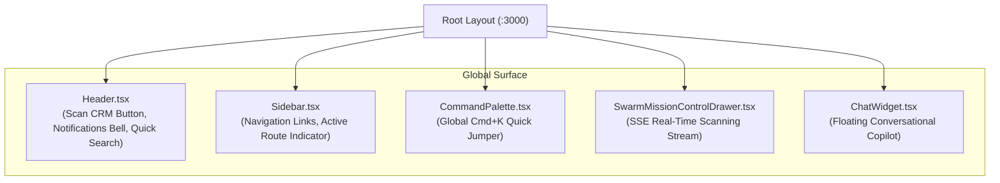

# 🖥️ Next.js 16 Command Center & Dashboard

The **OmniSales Dashboard** (`:3000`) is a modern enterprise web application built on **Next.js 16 (App Router)**, **TypeScript**, and **Tailwind CSS**. It serves as the primary operational surface for sales representatives and revenue executives to supervise the autonomous agent swarm, review Human-in-the-Loop drafts, inspect real-time telemetry, and enforce commercial governance before dispatching Razorpay billing links.

---

## 1. Design System & Aesthetics

- **Visual Architecture**: Sleek, glassmorphic dark-mode default with high-contrast text typography, subtle border gradients, and responsive micro-animations.
- **Color Tokens**: Standardized against accessibility guidelines:
  - 🟢 **Success / Healthy**: `#0ca30c`
  - 🟡 **Warning / Elevated**: `#fab219`
  - 🟠 **At-Risk**: `#ec835a`
  - 🔴 **Critical Violation / High Churn**: `#d03b3b`
  - 🟣 **Autonomous Intelligence**: Violet / Purple accents highlighting AI reasoning nodes.
- **Zero Placeholder Guarantee**: No synthetic "Lorem Ipsum" or fake placeholders; all views populate from live PostgreSQL, HubSpot CRM, or real-time agent streams.

---

## 2. Core Navigation & Global Components

### Component Catalog
1. **`Header.tsx`**:
   - Hosts the **"Scan CRM"** trigger that slides out Swarm Mission Control.
   - Live notification badge pulling real-time count of tasks in `pending_approval`.
   - Global search input bound to `⌘K` / `Ctrl+K`.
2. **`SwarmMissionControlDrawer.tsx`**:
   - Slides out from the right on demand.
   - Connects to `GET /api/orchestrator/scan/stream` (Server-Sent Events).
   - **Active Target Spotlight**: Visual laser beam animation tracking which lead, deal, or account is currently undergoing LLM evaluation.
   - Dynamic metric counters for tokens streamed, signals detected, and approval tasks queued.
3. **`FormattedDraft.tsx`**:
   - Renders outgoing email drafts into pixel-perfect HTML preview representations.
   - Injects real payment buttons (`Pay via Razorpay`) with authentic brand styling, email headers, and company signatures.
4. **`DraftEditorModal.tsx`**:
   - Offers dual-mode editing: **Write / Edit Mode** (editable inputs for subject and body) and **Preview Formatted Mode** (rendering live HTML).
   - Includes one-click **"Approve & Dispatch"** and **"Reject with Feedback"** action buttons.
5. **`DealDeskForm.tsx`**:
   - Interactive commercial policy evaluation widget.
   - Reps test discount sliders, contract months, and payment terms in real time.
   - Blocks unauthorized terms (e.g., >20% discount) with policy violation badges and automated counter-proposals.
   - Generates live Razorpay checkout links on compliance or manager override.
6. **`ReasoningTrace.tsx`**:
   - Collapsible thinking trace exposing the exact LLM reasoning steps, model used, execution duration, and token cost breakdown ($/task).

---

## 3. Page Breakdown & Routes

| Route | Page Name | Primary Features |
| :--- | :--- | :--- |
| `/dashboard` | **Revenue Command Center** | High-level ARR scorecard (Active Pipeline, ARR at Risk, Churn Risk), active agent swarm status cards, and live audit trail activity feed. |
| `/dashboard/approvals` | **Human-in-the-Loop Queue** | Central approval gate for Closer, Prospector, and Guardian drafts. Filter by agent and owner ("My Tasks / All Tasks"). Inline draft editing. |
| `/dashboard/pipeline` | **Sales Pipeline** | Sortable table of all active deals, ARR values, stages, risk indicators, and owner assignments. |
| `/dashboard/pipeline/[id]` | **Deal Inspector & Deal Desk** | Individual deal view with full chronological conversation thread, streaming Closer reasoning trace, and the interactive Deal Desk payment link generator. |
| `/dashboard/prospecting` | **Autonomous Prospecting** | Leads queue with Tier A–D ICP fit score breakdown, firmographic radar, Lead Detail Drawer, and CSV batch import modal. |
| `/dashboard/churn` | **Retention & Churn Defense** | Portfolio account cards with telemetry breakdowns (API drops, P1 tickets, login decay) and 30-day retention playbook generation drawers. |
| `/dashboard/evals` | **Evals & Reliability** | Real-time approval rate scorecard, token usage & cost analysis table ($/decision), OpenEvals 65-scenario benchmark scorecard, and direct LangSmith project links. |
| `/dashboard/intelligence` | **Competitive Intelligence** | Live competitor battlecards powered by the Spy Agent via Google A2A protocol. |
| `/dashboard/settings` | **System & Diagnostics** | Live diagnostic probes checking connectivity to Groq, Neon PostgreSQL, Redis, Kafka, Pinecone, Resend, and HubSpot CRM. |
| `/login` | **Enterprise Login** | JWT-based authentication screen with pre-filled demo credentials. |
