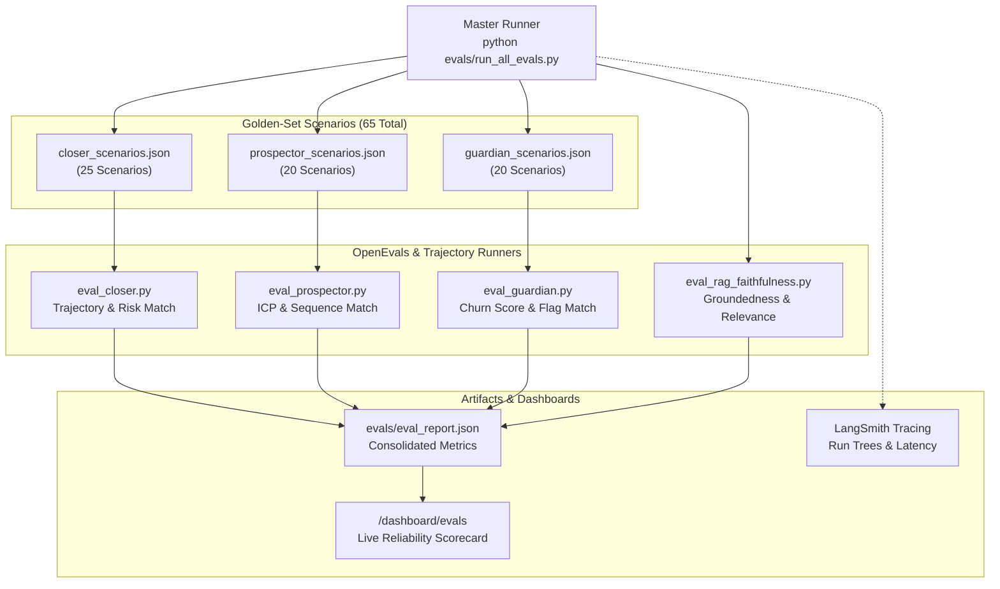

# 🧪 Evaluation, Reliability & Observability Suite

OmniSales includes a production-grade evaluation framework built on **OpenEvals** and **LangSmith**. It continuously validates agent decision quality, LangGraph trajectory adherence, RAG retrieval faithfulness, and financial token consumption across a benchmark of 65 golden-set scenarios.

---

## 1. Evaluation Architecture



---

## 2. The 65-Scenario Golden Set Benchmark

The benchmark comprises 65 realistic B2B enterprise scenarios designed to rigorously test both standard operations and edge cases:

### 1. Closer Golden Set (25 Scenarios)
- **Scenarios Evaluated**: 10-day pricing silence, AcmeCRM competitor displacement objections, implementation timeline pushback, pricing concession demands, inbound meeting confirmations, and payment link requests.
- **Evaluation Criteria**:
  - **Risk Classification Accuracy**: Exact match against expected risk level (`healthy`, `at_risk`, `critical`).
  - **LangGraph Trajectory Adherence**: Verification that the execution path traversed the expected nodes (e.g., `analyze_deal` -> `classify_risk` -> `query_spy_a2a` -> `handle_objection` -> `draft_followup`).
  - **Variance Analysis**: 5x-repeat variance check ensuring consistent decision-making under stochastic generation.

### 2. Prospector Golden Set (20 Scenarios)
- **Scenarios Evaluated**: Series A enterprise infrastructure startups, mid-market SaaS companies, early-stage bootstrap projects, and non-target local services (plumbing, restaurants).
- **Evaluation Criteria**:
  - **ICP Score Calibration**: Verifies that enterprise candidates score >= 0.85 (Tier A) while non-tech companies score < 0.50 (Tier D).
  - **Disqualification Safeguard**: Confirms that Tier D leads terminate early without wasting LLM tokens on sequence generation.
  - **Persona Targeting Accuracy**: Assesses whether identified contacts align with company size and buying authority.

### 3. Guardian Golden Set (20 Scenarios)
- **Scenarios Evaluated**: API consumption drops (>40%), unresolved P1 tickets (>14 days), executive login decay, healthy high-consumption accounts, and contract renewal proximity.
- **Evaluation Criteria**:
  - **Churn Risk Correlation**: Measures correlation between multi-signal telemetry inputs and the resulting churn score.
  - **Ranking Fidelity**: Confirms that top 3 highest-risk accounts are flagged accurately out of a batch.
  - **Playbook Specificity**: Ensures retention strategies directly address root cause signals rather than regurgitating generic templates.

---

## 3. RAG Faithfulness & Retrieval Relevance (`eval_rag_faithfulness.py`)

Using **OpenEvals**, OmniSales evaluates the reliability of its Pinecone knowledge base:

1. **RAG Groundedness / Faithfulness**:
   - Assesses whether facts, pricing numbers, and SLA guarantees in agent drafts are strictly derived from retrieved context chunks.
   - **Zero Hallucination Standard**: Detects and penalizes any unauthorized pricing claims or phantom feature commitments.
2. **Retrieval Relevance**:
   - Evaluates whether the vector search query successfully pulled the most relevant objection-handling playbook from Pinecone.

---

## 4. Financial Inference Accounting & Live Scorecard

In the dashboard (`/dashboard/evals`), OmniSales surfaces real-time financial and reliability telemetry:

- **Rep Approval Rate**: Percentage of AI-generated drafts approved by sales reps without significant edits.
- **Token Usage per Decision**: Average prompt and completion tokens consumed per agent action.
- **Cost per Task**: Real financial cost calculated using live Groq inference rates (typically **$0.0006 – $0.0012 per task**).
- **Model Distribution**: Ratio of complex reasoning (`openai/gpt-oss-120b`) to fast scoring (`openai/gpt-oss-20b`).

---

## 5. Running the Evaluation Suite

To execute the complete benchmark and refresh `evals/eval_report.json`:

```bash
# Run the master evaluation runner
python evals/run_all_evals.py

# Run individual agent evaluations
python evals/eval_closer.py
python evals/eval_prospector.py
python evals/eval_guardian.py
python evals/eval_rag_faithfulness.py
```
