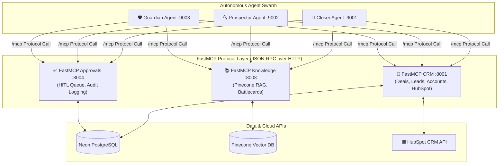

# 🔌 Model Context Protocol (FastMCP) Servers

OmniSales adopts the open **Model Context Protocol (FastMCP)** standard for all vertical integrations between the AI agent workforce and underlying data stores, business applications, and human approval gates.

---

## 1. Why FastMCP?

In traditional agent systems, tools are hardcoded as custom Python functions inside agent prompts. This tight coupling creates severe technical debt: changing a database schema or swapping an email vendor requires refactoring agent reasoning loops.

By standardizing on **FastMCP**:
1. **Zero Agent Code Changes**: Agents discover available tools dynamically via the standard MCP protocol handshake (`/mcp`).
2. **Independent Scaling**: MCP servers run as independent, lightweight HTTP microservices that can be horizontally scaled, cached, or replaced without restarting the agent swarm.
3. **Decoupled Security**: External credential access (PostgreSQL passwords, HubSpot Private App tokens, Pinecone API keys) is isolated inside dedicated MCP containers. The agents themselves never touch raw credentials.

---

## 2. MCP Server Topology

---

## 3. FastMCP Server Reference Guides

- **[💾 FastMCP CRM Server (`:8001`)](crm.md)**: Database operations for deals, leads, and accounts; real-time bidirectional synchronization with HubSpot CRM.
- **[📚 FastMCP Knowledge Server (`:8003`)](knowledge.md)**: Semantic Pinecone vector search over sales playbooks, objection battlecards, and case studies.
- **[✅ FastMCP Approvals Server (`:8004`)](approvals.md)**: Human-in-the-Loop task creation, state transitions, draft editing, and agent regeneration loops.
