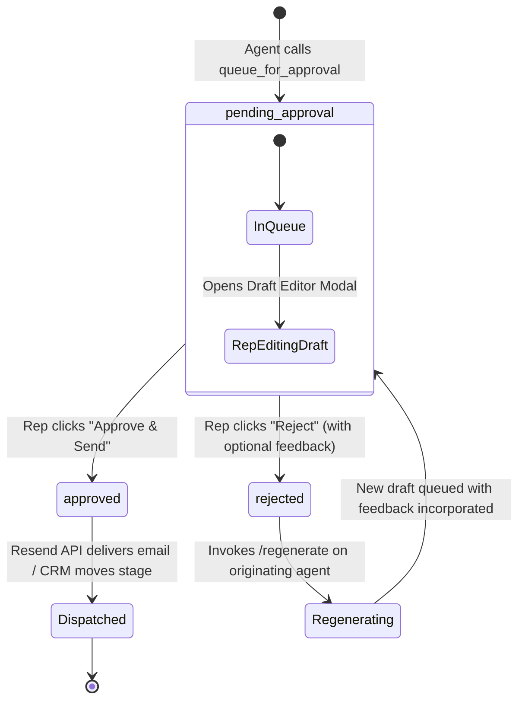

# ✅ FastMCP Approvals Server & HITL Gate

The **FastMCP Approvals Server** (`:8004`) enforces the Human-in-the-Loop (HITL) boundary for the entire OmniSales platform. It manages the lifecycle of all AI-generated drafts, outreach cadences, and retention playbooks, ensuring that no communication reaches an external customer without explicit human supervisor sign-off.

---

## 1. FastMCP Tools Exposed

| Tool Name | Parameters | Purpose |
| :--- | :--- | :--- |
| `queue_for_approval` | `agent_name, task_type, target_type, target_id, target_name, draft, reasoning, model_used, tokens_used, cost` | Registers a new pending approval task in `agent_tasks` and writes audit log |
| `list_pending` | `agent_name: str = None, limit: int = 50` | Fetches tasks awaiting human review |
| `approve_task` | `task_id: str, feedback: str = "", draft: str = None` | Marks task approved, persists edited copy, and triggers execution |
| `reject_task` | `task_id: str, feedback: str = ""` | Rejects draft, records prompt feedback, and triggers agent regeneration |
| `get_task` | `task_id: str` | Fetches full task metadata and reasoning trace |

---

## 2. Task State Machine & Lifecycle

---

## 3. Human Editorial & Regeneration Loop

1. **Dual-Mode Editing**:
   In the Next.js Approvals dashboard (`/dashboard/approvals`), reps can review the draft in **Preview Formatted Mode** (rendering rich HTML typography, signatures, and Razorpay buttons) or switch to **Write / Edit Mode** to customize copy before dispatch.
2. **Autonomous Regeneration Loop**:
   When a task is rejected with constructive feedback (e.g., *"The tone is too formal, and mention our Net 45 terms"*), the server invokes the originating agent's `/regenerate/{task_id}` endpoint:
   - The agent retrieves the previous draft, the human critique, and the original deal context.
   - It executes a feedback-directed re-prompting pass.
   - The revised draft replaces the old proposal in the approvals queue with updated reasoning.

---

## 4. Endpoints & Protocol Mount

- **MCP Protocol Endpoint**: `http://mcp-approvals:8004/mcp`
- **Health Endpoint**: `http://mcp-approvals:8004/health`
