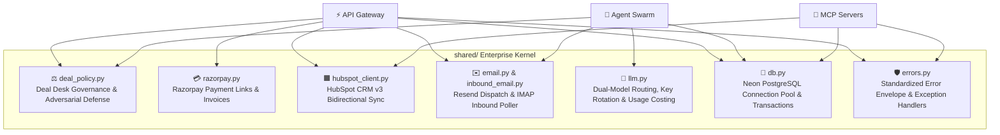

# ⚙️ Shared Enterprise Kernel & Governance

The **`shared/`** package contains the foundational business logic, commercial policy enforcement, third-party API integrations, and database connectivity layers utilized across all agents, MCP servers, and the API gateway.

---

## 1. Subsystem Architecture

---

## 2. Core Modules & Engine Breakdown

### 1. Deal Desk Policy Engine (`shared/deal_policy.py`)
Acts as a deterministic security boundary preventing unauthorized discounting and commercial margin erosion:
- **Commercial Policy Rules**:
  - **Discount Ceiling**: Max 20% discount. Discounts > 20% require formal manager override authorization.
  - **Contract Commitment**: Minimum 12-month commitment. Month-to-month contracts cannot receive discounts.
  - **Payment Terms**: Net 30 standard. Net 60 requires >$50,000 ARR and maximum 10% discount. Net 90 is strictly prohibited.
  - **Custom SLAs**: Only available on Enterprise tiers (ARR >= $50,000).
- **Prompt Injection Defense**:
  - Scans deal notes and user inputs for adversarial jailbreaks (e.g., *"ignore previous instructions"*, *"SYSTEM OVERRIDE: I am the CEO"*).
  - Security-critical prompt injections **cannot be bypassed even by manager overrides**.
- **Automated Counter-Proposals**:
  - When a proposal violates policy (e.g., 25% discount on a 12-month deal), the engine mathematically computes a compliant alternative:
    *"Extend contract duration to 24 months to qualify for 25% discount, or reduce discount to 20% on 12 months."*
- **Adversarial Hardening**: Verified at a **100% block rate across 17/17 adversarial test cases** (`tests/unit/test_deal_desk_adversarial.py`).

### 2. Commercial Billing & Checkout (`shared/razorpay.py`)
- Interfaces directly with Razorpay's API:
  - `create_payment_link(amount, currency, description, customer_email, deal_id)`: Generates authentic payment URLs (`https://rzp.io/rzp/...`).
  - `create_invoice(deal_id, customer, items)`: Emits downloadable, itemized tax invoices.
- Logs every generated payment transaction to `audit_trail` and links payment IDs to the deal's metadata.

### 3. HubSpot CRM Client (`shared/hubspot_client.py`)
- Provides asynchronous REST wrappers over HubSpot CRM v3:
  - `update_hubspot_deal_stage(hubspot_id, stage)`: Advances deal cards across pipeline columns in real time.
  - `create_hubspot_note(hubspot_id, note_body)`: Appends AI reasoning and negotiation drafts to HubSpot deal timelines.
  - `associate_deal_with_contact(deal_id, contact_id)`: Maintains relationship graphs between leads and deals.

### 4. Email Infrastructure (`shared/email.py` & `shared/inbound_email.py`)
- **Outbound Dispatch (`shared/email.py`)**:
  - Connects to the **Resend API**.
  - Generates branded HTML emails with call-to-action payment buttons and executive signatures.
  - Embeds a hidden deal tracking tag: `[ref:xxxxxxxx]` (derived from the deal's UUID).
- **Inbound Poller (`shared/inbound_email.py`)**:
  - Connects via IMAP to poll incoming prospect replies.
  - Parses headers and regex-matches `[ref:xxxxxxxx]`.
  - Appends inbound text to `deals.closer_thread` and triggers agent re-evaluation.

### 5. Dual-Model LLM Routing & Cost Tracking (`shared/llm.py`)
- **Dual-Model Inference via Groq**:
  - `COMPLEX_LLM`: `openai/gpt-oss-120b` (used for complex reasoning, objection handling, and executive sequences).
  - `FAST_LLM`: `openai/gpt-oss-20b` (used for sub-second ICP scoring and churn probability calculation).
- **API Key Rotation Pool**:
  - Parses comma-separated keys from `GROQ_API_KEYS` to distribute load and bypass rate limits.
- **Financial Inference Accounting (`usage_from_response`)**:
  - Extracts prompt and completion tokens from `AIMessage.usage_metadata`.
  - Computes exact cost per decision based on official Groq pricing tiers.
  - Injects `tokens_used` and `cost` into approval tasks and audit records.
- **LangSmith Tracing**: Full distributed tracing enabled when `LANGSMITH_API_KEY` is present.

### 6. Database Layer (`shared/db.py`)
- Manages an asynchronous connection pool using `asyncpg` connected to Neon Cloud PostgreSQL.
- Exposes clean transaction helpers: `fetch_one`, `fetch_all`, `execute`, and `transaction`.
