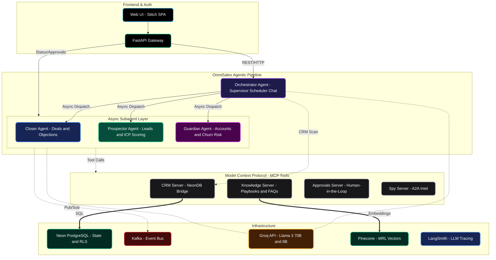
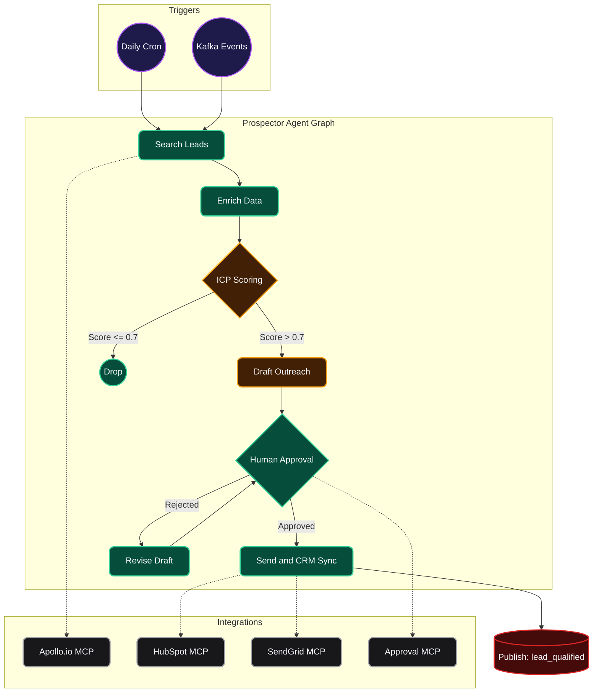
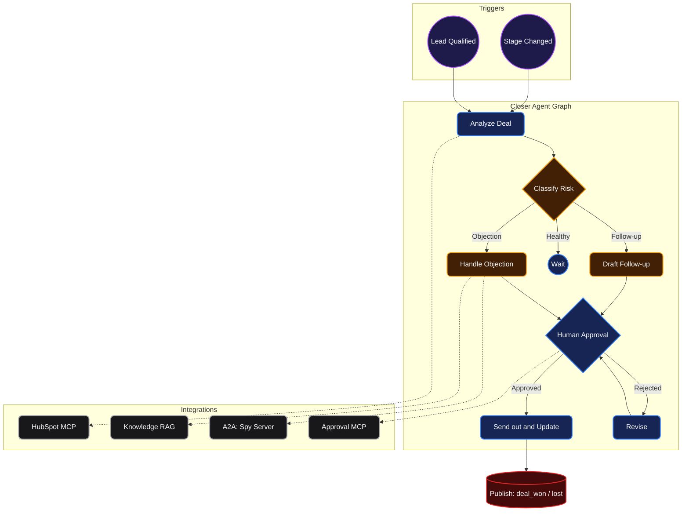
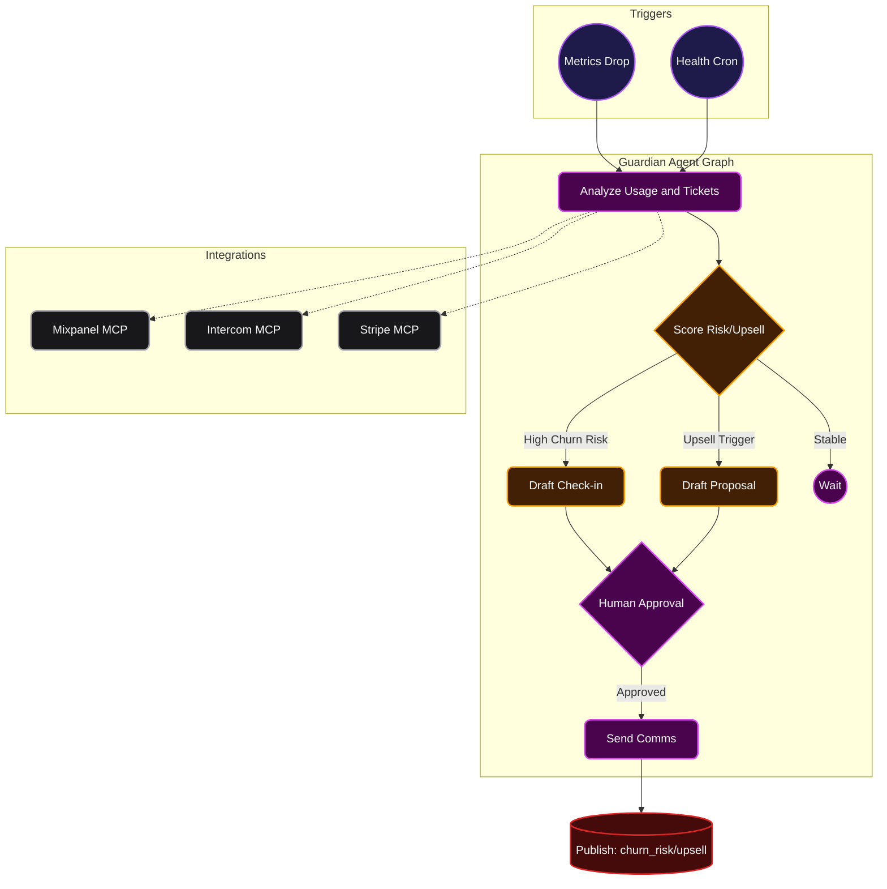
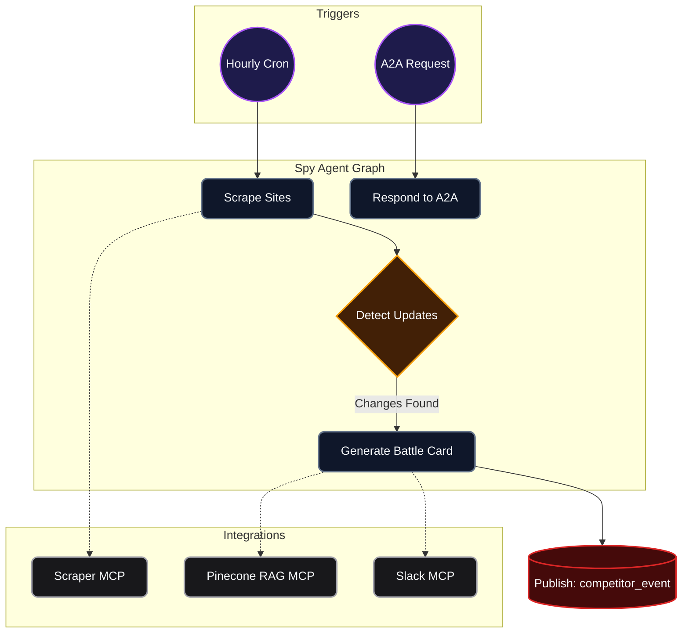

# OmniSales: The Autonomous Revenue Department

## Comprehensive Technical Architecture, Business Impact & Innovation Report

> **Version:** 2.0 — Hackathon Edition
> **Stack:** LangGraph · MCP · A2A · Kafka · Kubernetes · Docker
> **LLM:** Groq (`llama-3.3-70b-versatile` + `llama-3.1-8b-instant`)

---

## Table of Contents

1. [Executive Summary](#1-executive-summary)
2. [The Problem Space](#2-the-problem-space)
3. [Innovation & Paradigm Shift](#3-innovation--paradigm-shift)
4. [System Architecture](#4-system-architecture--technical-depth)
5. [The AI Agent Workforce](#5-the-ai-agent-workforce)
6. [Multi-Protocol Communication](#6-multi-protocol-communication-layer)
7. [Data Architecture](#7-data-architecture)
8. [Kubernetes Scaling Strategy](#8-kubernetes-scaling-strategy)
9. [Security & Compliance](#9-security--compliance)
10. [Observability & Resilience](#10-observability--resilience)
11. [Financial Impact Model](#11-detailed-financial-impact-model)
12. [Demo Scenarios](#12-demo-scenarios)
13. [Future Improvements](#13-future-improvements--time-constraints)

---

## 1. Executive Summary

OmniSales is a **production-grade, multi-agent AI system** that fundamentally reimagines how enterprise revenue operations function. Rather than augmenting existing CRM tools with bolt-on AI features, OmniSales replaces the entire fragmented sales software stack with four autonomous, specialized AI agents that continuously read data, make intelligent decisions, execute complex workflows, and self-correct — all while keeping humans firmly in the loop as strategic supervisors.

The system is built on three open protocol standards — **MCP** (Model Context Protocol) for vertical tool integration, **A2A** (Agent-to-Agent) for horizontal peer intelligence, and **Apache Kafka** for asynchronous event broadcasting — creating an architecture that is infinitely extensible, cloud-agnostic, and enterprise-ready from day one.

---

## 2. The Problem Space

Traditional enterprise sales teams waste the majority of their time acting as **human APIs** — manually moving data between siloed software tools. This systemic inefficiency leads to:

| Problem | Business Impact |
| :--- | :--- |
| **Leaked Revenue** | Missed follow-ups on warm leads result in deals going to competitors |
| **Pipeline Rot** | Deals go cold without intervention; reps discover too late |
| **Customer Churn** | Early warning signals buried in usage data go unnoticed for weeks |
| **Slow Competitive Response** | Reps learn about competitor price changes days or weeks late |
| **Data Quality Degradation** | CRM data accuracy depends entirely on reps remembering to update it |
| **Context Switching Overhead** | Reps juggle 8–12 software tools daily, losing 2+ hours to admin |

**The core insight:** 80% of what a sales team does is information routing — find a lead, research them, write an email, log the activity, check if they replied, follow up if not. These are automatable workflows, not tasks requiring human judgment.

---

## 3. Innovation & Paradigm Shift

### 3.1 Why OmniSales Is a Category-Defining Innovation

OmniSales does not iterate on the CRM category — it **obsoletes** it. Where Salesforce, HubSpot, and Outreach are fundamentally passive data repositories that require human operators to extract value, OmniSales is an **active, autonomous revenue engine** that generates value independently.

This is not "AI-assisted sales." This is **AI-native sales** — a system where intelligence is not a feature bolted onto a database, but the foundational operating principle of the entire architecture.

### 3.2 The Three-Protocol Innovation

The most significant architectural innovation in OmniSales is the **Three-Protocol Communication Model** — a pattern that, to our knowledge, has never been implemented in a production sales system:

| Protocol | Direction | Analogy | Innovation |
| :--- | :--- | :--- | :--- |
| **MCP** | Vertical (agent → tool) | A worker's toolbox | Agents discover and use tools at runtime without hardcoded integrations. Swap SendGrid for Postmark — zero agent code changes. |
| **A2A** | Horizontal (agent ↔ agent) | A direct phone call between colleagues | Agents share real-time intelligence mid-workflow. The Closer can pause mid-email-draft to fetch a live competitor battle card from the Spy. |
| **Kafka** | Async broadcast | A company-wide announcement | One agent's output automatically triggers another's workflow. Guardian detects churn → Prospector automatically targets replacement accounts. |

This three-axis model creates an **emergent intelligence network** where the collective capability of the system vastly exceeds the sum of its individual agents. A churn signal detected by the Guardian doesn't just sit in a dashboard — it simultaneously triggers the Prospector to source replacements, alerts the Closer to accelerate related deals, and prompts the Spy to investigate competitor activity.

### 3.3 Beyond Rule-Based Automation

Traditional sales automation (Outreach, SalesLoft) follows rigid, pre-programmed cadences — "send email on Day 1, follow up on Day 3, call on Day 7." OmniSales agents use **LangGraph's cyclic reasoning graphs** with LLM-powered decision nodes, enabling:

- **Adaptive Decision Making:** The Closer doesn't follow a fixed cadence. It reads the full conversation thread, classifies the deal's risk level using an LLM, and decides whether to draft a follow-up, handle an objection, or escalate to a human.
- **Cross-Agent Intelligence Fusion:** When the Closer detects a competitor mention in a deal thread, it doesn't just flag it — it calls the Spy agent via A2A to fetch a real-time battle card, retrieves objection-handling documentation from Pinecone via RAG, and synthesizes a response that addresses the specific competitive threat.
- **Self-Correcting Loops:** If a drafted email is rejected by a human supervisor, the agent doesn't just discard it — it incorporates the feedback into its reasoning chain and generates a revised draft that reflects the human's corrections.

### 3.4 Human-in-the-Loop as a First-Class Architectural Primitive

Unlike systems that treat human approval as an afterthought, OmniSales enforces HITL at **three independent layers**:

1. **LangGraph Level:** `interrupt_before=["human"]` pauses the graph and serializes state to PostgreSQL.
2. **MCP Server Level:** The Approval Queue MCP server enforces that no outbound communication is sent without an explicit approval record.
3. **Database Level:** The `agent_tasks` table requires `status = 'approved'` before any send operation.

This triple-gate architecture ensures that even if one layer fails, no unauthorized communication can leave the system.

### 3.5 Unique Value Proposition vs. Existing Tools

| Capability | Existing Tools (HubSpot, Salesforce) | OmniSales |
| :--- | :--- | :--- |
| Deal risk detection | Manual pipeline review | Real-time LLM risk classification |
| Objection handling | Static playbook templates | RAG over company docs + live competitive intel |
| Follow-up timing | Rule-based cadences | Adaptive, context-aware drafting |
| Competitive intel | Manual research / alerts | Autonomous scraping + battle card generation |
| Cross-agent coordination | None (siloed tools) | Kafka + A2A event broadcasting |
| Churn prediction | Lagging indicator dashboards | Proactive multi-signal LLM scoring |

---

## 4. System Architecture & Technical Depth

### 4.1 High-Level Architecture Diagram

### 4.2 Full Technology Stack

| Layer | Technology | Why This Choice |
| :--- | :--- | :--- |
| **Agent Orchestration** | LangGraph 0.2+ | Native cyclic graphs, interrupt/resume for HITL, state checkpointing |
| **Backend API** | FastAPI + Python 3.12 | Async-first, Pydantic validation, perfect for LLM I/O |
| **LLM — Complex** | Groq `llama-3.3-70b-versatile` | Risk classification, objection handling, email drafting |
| **LLM — Simple** | Groq `llama-3.1-8b-instant` | ICP scoring, status checks, data extraction |
| **Message Queue** | Apache Kafka | Durable event log, async comms, full replay audit |
| **Primary Database** | PostgreSQL 16 | ACID, RLS for multi-tenancy, JSONB |
| **Vector Store** | Pinecone | Semantic search for RAG (company docs, battle cards) |
| **Caching / State** | Redis Cluster | Agent state, rate limiting, pub/sub for real-time UI |
| **Frontend** | Next.js 14 (App Router) | React Server Components, WebSocket integration |
| **Container Orch.** | Kubernetes (GKE) | KEDA autoscaling, namespace isolation |
| **Agent Scaling** | KEDA | Scale pods on Kafka consumer lag |
| **Service Mesh** | Istio | mTLS, traffic management, distributed tracing |
| **Observability** | Datadog + LangSmith | APM + LLM tracing, token costs, decision audit |
| **CI/CD** | GitHub Actions + ArgoCD | GitOps, declarative K8s deployments |
| **Secrets** | HashiCorp Vault | Dynamic secret injection, API key rotation |
| **A2A Protocol** | A2A (Google → Linux Foundation) | Peer-to-peer agent comms, Agent Cards |

---

## 5. The AI Agent Workforce

### 5.1 The Prospector — New Customer Acquisition

**Role:** Tireless Business Development Representative that operates 24/7.

**Function:** Scrapes public data to find ICP-matching leads, researches company news/funding/hiring signals, drafts hyper-personalized cold outreach, manages communication until a meeting is booked.

**Triggers:** Daily cron · Kafka `spy.competitor_event` · Kafka `guardian.churn_risk` · Manual API

### 5.2 The Closer — Active Deal Management

**Role:** AI Co-Pilot for the Account Executive that prevents pipeline rot.

**Function:** Monitors all pipeline deals, detects stalled/at-risk deals, drafts contextual follow-up emails, handles objections via RAG over company docs, gets live competitive intel from The Spy via A2A.

**Triggers:** Kafka `deal.stage_changed` · Cron (daily staleness check) · Email webhook · Kafka `prospector.lead_qualified`

### 5.3 The Guardian — Customer Retention & Upselling

**Role:** Proactive Customer Success Manager that never sleeps.

**Function:** Watches usage metrics and support tickets, detects churn signals before they become cancellations, sends check-in emails, detects plan limit approach (upsell signal), drafts upgrade proposals.

**Triggers:** Kafka `usage.metric_drop` · Kafka `support.ticket_opened` · Cron (weekly health) · Kafka `closer.deal_won`

### 5.4 The Spy — Competitive Intelligence (Post-MVP)

**Role:** Strategic researcher that feeds the other three agents with real-time market intelligence.

**Function:** Monitors competitor websites/pricing via Playwright, detects changes using HTML diffing + LLM interpretation, updates Pinecone battle cards, broadcasts events via Kafka. **Only agent that acts as an A2A server.**

---

## 6. Multi-Protocol Communication Layer

### 6.1 Kafka Topics — Full Event Reference

| Topic | Publisher | Subscribers | Payload |
| :--- | :--- | :--- | :--- |
| `spy.competitor_event` | Spy | Prospector, Closer | competitor, event_type, prices, timestamp |
| `prospector.lead_qualified` | Prospector | Closer | lead_id, icp_score, company, contact |
| `guardian.churn_risk` | Guardian | Prospector | account_id, churn_risk, reason, competitor |
| `guardian.upsell_opportunity` | Guardian | Closer | account_id, current_plan, usage_pct |
| `closer.deal_won` | Closer | Guardian | account_id, deal_id, arr |
| `closer.deal_lost` | Closer | — | deal_id, reason |

### 6.2 Per-Agent Communication Map

| Agent | Publishes (Kafka) | Subscribes (Kafka) | Calls (A2A) | Exposes (A2A) |
| :--- | :--- | :--- | :--- | :--- |
| Prospector | `lead_qualified` | `spy.competitor_event`, `guardian.churn_risk` | spy: `get_winback_strategy` | — |
| Closer | `deal_won`, `deal_lost` | `spy.competitor_event`, `prospector.lead_qualified` | spy: `get_battlecard` | — |
| Guardian | `churn_risk`, `upsell_opportunity` | `closer.deal_won` | spy: `get_competitor_usage` | — |
| Spy | `competitor_event` | — | — | 4 skills |

---

## 7. Data Architecture

### 7.1 PostgreSQL Core Schema (with Row-Level Security)

The relational data layer uses **PostgreSQL 16** with Row-Level Security (RLS) enforced on every table for multi-tenant isolation. Key tables include:

- **`leads`** — Stores lead data with ICP scores, enrichment JSONB, and status tracking.
- **`deals`** — Active pipeline deals with stage progression, risk levels, conversation threads, and immutable agent audit logs.
- **`accounts`** — Customer accounts with health scores, churn risk, plan details, and Stripe customer references.
- **`agent_tasks`** — The approval queue: every agent-drafted action sits here awaiting human review.
- **`scan_reports`** — Orchestrator scan history with LLM summaries.
- **`competitors`** — Competitor profiles with pricing hashes for change detection.

### 7.2 Pinecone RAG Pipeline

Content stored in Pinecone using **Native Integrated Inference** with per-org namespace isolation:
- Product documentation (objection handling)
- Case studies (personalization)
- Pre-approved response templates
- Competitor battle cards
- Historical email templates

### 7.3 Redis Usage

| Use | Details |
| :--- | :--- |
| Agent state cache | Ephemeral in-flight state, TTL-based cleanup |
| API rate limiting | Per-org, per-endpoint sliding window |
| WebSocket pub/sub | Real-time approval queue updates to dashboard |

---

## 8. Kubernetes Scaling Strategy

OmniSales is architected for automated, robust scaling using **Google Kubernetes Engine (GKE)** with both vertical and horizontal scaling strategies tailored specifically for I/O-bound LLM agent workloads.

### 8.1 Vertical Scaling

Vertical scaling grants more CPU and RAM to specific pods that require heavier compute:

- **LLM Inference Offload:** By relying on Groq's Language Processing Units (LPUs), the heaviest compute — running 70-billion-parameter model weights — is offloaded entirely to external infrastructure capable of 500+ tokens/second inference. This means agent pods remain lightweight and CPU-efficient.
- **Database Vertical Scaling:** Neon PostgreSQL provides instantaneous, serverless vertical scaling. During peak pipeline processing (e.g., end-of-quarter deal rush), the database compute scales up automatically without manual intervention or downtime.
- **Pod Resource Boundaries:** Each agent pod is configured with strict Kubernetes resource requests and limits (e.g., 512Mi request / 1Gi limit for RAM, 250m request / 1 core limit for CPU), allowing the Kubernetes scheduler to make optimal placement decisions and enabling Vertical Pod Autoscaler (VPA) recommendations.

### 8.2 Horizontal Scaling via KEDA

OmniSales uses **KEDA (Kubernetes Event-Driven Autoscaling)** rather than traditional CPU-based HPA, because LLM agents are fundamentally I/O-bound workloads.

**The Problem with Standard HPA:** Traditional Horizontal Pod Autoscalers scale based on CPU utilization. For agents that spend 90% of their time waiting for LLM API responses, Kafka messages, or database queries, CPU utilization remains low (often 5–15%) even when the task backlog is massive. Standard HPA would never trigger a scale-up despite hundreds of pending tasks.

**The KEDA Solution:** KEDA scales pods based on **Kafka consumer lag** — the actual backlog of unprocessed messages. This is the correct scaling signal for event-driven, I/O-bound architectures.

### 8.3 Replica Scaling Reference

| Workload | Min Replicas | Max Replicas | Scale Trigger | Cooldown |
| :--- | :---: | :---: | :--- | :---: |
| **Closer** ★ | 2 | 10 | Kafka lag: `closer.tasks` > 20 | 60s |
| **Prospector** | 1 | 12 | Kafka lag: `prospector.tasks` > 30 | 60s |
| **Guardian** | 1 | 8 | Kafka lag: `guardian.tasks` > 25 | 60s |
| **Spy** | 0 | 5 | Kafka lag + hourly cron | 120s |
| **MCP Scraper** | 1 | 5 | Kafka lag: `scraper.tasks` > 10 | 60s |
| **API Gateway** | 2 | 8 | HPA CPU ≥ 70% | 30s |
| **Dashboard** | 2 | 4 | HPA CPU ≥ 80% | 30s |

### 8.4 Namespace Isolation Strategy

| Namespace | Contents | Network Access |
| :--- | :--- | :--- |
| `omnisales-agents` | 4 agent pods | → omnisales-mcp, Kafka, Vault only |
| `omnisales-mcp` | MCP server pods | → External APIs (via egress policy) |
| `omnisales-gateway` | API gateway, dashboard | → omnisales-agents, internet |
| `omnisales-data` | Managed DB/Redis access | — |

### 8.5 Pod Disruption Budgets & Topology

Every critical workload has a **PodDisruptionBudget** ensuring at minimum 1 pod remains available during rolling updates or node drains. **TopologySpreadConstraints** ensure pods are spread across nodes to survive individual node failures.

---

## 9. Security & Compliance

| Concern | Solution | Implementation |
| :--- | :--- | :--- |
| **Multi-Tenancy** | PostgreSQL RLS + Namespaces | `org_id` on every table, RLS policies, K8s namespace isolation |
| **Secret Management** | HashiCorp Vault | Vault sidecar injects secrets at pod startup; keys rotated weekly |
| **Service-to-Service** | Istio mTLS (STRICT) | All inter-pod traffic encrypted; zero-trust |
| **Prompt Injection** | Input Sanitization | Strip HTML/special chars; system prompts hardened |
| **Email Sending** | Triple Approval Gate | No email without approval — enforced at graph + gateway + DB level |
| **Audit Trail** | Immutable `agent_log` JSONB | Every decision logged with timestamp, reasoning, token usage |
| **Container Security** | Non-root users | All containers UID 1001/1002; read-only root FS |
| **API Security** | JWT + rate limiting | Per-org rate limits enforced at gateway |
| **Image Security** | Trivy scanning in CI | CVE scan before push; critical CVEs block deployment |

---

## 10. Observability & Resilience

### 10.1 Three-Layer Observability

| Layer | Tool | Coverage |
| :--- | :--- | :--- |
| Infrastructure + APM | Datadog | Pod health, CPU/memory, API latency, error rates |
| LLM tracing | LangSmith | Token usage, LLM latency, decision traces, prompt versions |
| Alerting | PagerDuty | Agent failures, approval queue buildup, churn spikes |

### 10.2 Error Handling & Resilience

| Failure Mode | Strategy |
| :--- | :--- |
| **LLM rate limit (429)** | Multi-key rotation — retry with next Groq key (Round-Robin) |
| **LLM timeout / error** | Exponential backoff (3 retries), fallback to `FAST_LLM` if `COMPLEX_LLM` fails |
| **Kafka consumer crash** | Consumer group auto-rebalance; messages retained for replay |
| **Database unavailable** | Circuit breaker; agent pauses and retries on reconnect |
| **Pinecone unavailable** | Graceful degradation — proceed without RAG, flag in reasoning |
| **Invalid LLM output** | Pydantic parsing with retry; `with_structured_output()` enforcement |
| **Human approval timeout** | Configurable TTL (24h default); auto-escalation notification |
| **MCP server down** | Health checks + circuit breaker; agent skips tool and logs gap |

---

## 11. Detailed Financial Impact Model

> **Assumptions & Methodology:**
> - Average Contract Value (ACV): ₹33,20,000 ($40,000 × ₹83)
> - Sales Cycle: 60–90 days
> - Exchange Rate: **1 USD = ₹83**
> - All salaries converted at US mid-market SaaS rates × ₹83
> - Human SDR productivity: 50 personalized emails/day (biological limit)
> - Agent productivity: 500 personalized emails/day (domain reputation limit, not compute limit)
> - 240 working days per year

### 11.1 Scenario A: Traditional Sales Department

A standard mid-market B2B SaaS sales motion relying on manual human labor.

#### Operational Costs (Annual)

| Expense Category | Role / Item | Qty | Annual Cost per Unit (₹) | Total Annual Cost (₹) |
| :--- | :--- | :---: | ---: | ---: |
| **Headcount** | Account Executive (AE) | 10 | ₹1,24,50,000 | ₹12,45,00,000 |
| **Headcount** | Sales Dev. Rep (SDR) | 5 | ₹66,40,000 | ₹3,32,00,000 |
| **Headcount** | Sales Manager | 1 | ₹1,49,40,000 | ₹1,49,40,000 |
| *Subtotal: Headcount* | *16 FTEs* | | | *₹17,26,40,000* |
| **Software** | CRM (Salesforce) | 16 seats | ₹1,49,400 | ₹23,90,400 |
| **Software** | Sales Engagement (Outreach) | 16 seats | ₹99,600 | ₹15,93,600 |
| **Software** | LinkedIn Sales Navigator | 16 seats | ₹99,600 | ₹15,93,600 |
| **Data** | B2B Contact Database (ZoomInfo) | 1 org | ₹20,75,000 | ₹20,75,000 |
| *Subtotal: Software & Data* | | | | *₹76,52,600* |
| **Total OpEx** | | | | **₹18,02,92,600** |

#### Revenue Output
- **Pipeline Generation:** 5 SDRs × 50 emails/day × 240 days = **60,000 emails/year**
- **Meeting Conversion:** 2.0% conversion rate = **1,200 meetings/year**
- **Win Rate:** 20% from meeting to closed-won
- **Deals Won:** 240 deals
- **Total Revenue: ₹79,68,00,000 (≈ ₹79.7 Cr)**

#### Traditional Efficiency
- **Revenue per ₹1 Spent:** ₹79.68 Cr / ₹18.03 Cr = **₹4.42**
- **Customer Acquisition Cost:** ₹18.03 Cr / 240 deals = **₹7,51,219 per customer**

---

### 11.2 Scenario B: OmniSales Augmented Department

AI agents handle all pipeline generation, follow-ups, CRM updates, and competitive intelligence. Humans are shifted to high-value closing and relationship roles.

#### Operational Costs (Annual)

| Expense Category | Role / Item | Qty | Annual Cost per Unit (₹) | Total Annual Cost (₹) |
| :--- | :--- | :---: | ---: | ---: |
| **Headcount** | High-Performer AE | 5 | ₹1,24,50,000 | ₹6,22,50,000 |
| **Headcount** | Elite SDR (Approvals & Whales) | 1 | ₹66,40,000 | ₹66,40,000 |
| **Headcount** | Director of Sales | 1 | ₹1,49,40,000 | ₹1,49,40,000 |
| *Subtotal: Headcount (56% reduction)* | *7 FTEs* | | | *₹8,38,30,000* |
| **Software** | CRM / Engagement / Sales Nav | 7 seats | ₹3,48,600 | ₹24,40,200 |
| **Data** | B2B Contact Database (ZoomInfo) | 1 org | ₹20,75,000 | ₹20,75,000 |
| **Agent Infra** | LLM Inference (Groq Dual-Model) | 4 agents | ~₹40/day | ₹14,525 |
| **Agent Infra** | Cloud (GKE, Kafka, Neon, Pinecone) | 1 cluster | ₹38,014/month | ₹4,56,168 |
| *Subtotal: Software & Infra* | | | | *₹49,85,893* |
| **Total OpEx** | | | | **₹8,88,15,893** |

#### Revenue Output
- **Pipeline Generation:** Prospector Agent outputs 500 emails/day × 240 days = **1,20,000 emails/year** (2x volume)
- **Meeting Conversion:** **2.5%** (due to superior personalization, instant follow-ups, and competitive battle-carding) = **3,000 meetings/year**
- **Win Rate:** **25%** (Closer prevents pipeline rot; Guardian flags issues before deal collapse)
- **Deals Won:** 750 deals
- **Total Revenue: ₹2,49,00,00,000 (≈ ₹249 Cr)**

#### OmniSales Efficiency
- **Revenue per ₹1 Spent:** ₹249 Cr / ₹8.88 Cr = **₹28.04**
- **Customer Acquisition Cost:** ₹8.88 Cr / 750 deals = **₹1,18,422 per customer**

---

### 11.3 The Financial Delta

| Metric | Traditional Dept. | OmniSales Dept. | Delta |
| :--- | :--- | :--- | :--- |
| **Annual OpEx** | ₹18.03 Cr | ₹8.88 Cr | **⬇ 50.7% Cost Reduction** |
| **Annual Revenue** | ₹79.68 Cr | ₹249.00 Cr | **⬆ 3.1x Revenue Multiplier** |
| **Deals Won** | 240 | 750 | **⬆ 3.1x More Deals** |
| **Sales CAC** | ₹7,51,219 | ₹1,18,422 | **⬇ 84.2% Cheaper Acquisition** |
| **Efficiency (Rev/₹1)** | ₹4.42 | ₹28.04 | **🚀 6.3x Better ROI** |
| **Headcount** | 16 FTEs | 7 FTEs | **⬇ 56% Headcount Reduction** |
| **Pipeline Volume** | 60,000 emails/yr | 1,20,000 emails/yr | **⬆ 2x Pipeline Generation** |

**Conclusion:** An OmniSales augmented department delivers a **6.3x structural advantage in capital efficiency**. By decoupling pipeline generation and deal management from biological constraints (working hours, context switching, CRM data entry), the system scales outbound volume by 2x while simultaneously reducing headcount by 56%, allowing human AEs to act as "Editors and Closers" rather than administrators.

---

## 12. Demo Scenarios

### Scenario 1: Deal Risk Alert (Closer Agent) — 8 Autonomous Steps

> A deal goes silent for 10 days after a pricing discussion.

1. **Detect:** Cron identifies Deal #4821 (Acme Corp, ₹99.6L ARR, Negotiation stage) — 10 days silent
2. **Load Context:** Closer pulls full deal record + email thread from Postgres
3. **Classify Risk:** `COMPLEX_LLM` classifies as `at_risk` — *"10-day silence post-pricing. Competitor AcmeCRM mentioned."*
4. **Check Competitor:** Agent detects competitor mention → queries Pinecone for battle cards
5. **RAG Retrieval:** Pulls 3 relevant chunks: pricing comparison, feature differentiators, case study
6. **Draft Re-engagement:** LLM drafts personalized email with competitive positioning
7. **HITL Pause:** Graph hits `interrupt_before` → state serialized → WebSocket push to dashboard
8. **Human Approval → Send:** Manager reviews, edits, approves → email sent → full audit logged

### Scenario 2: Cold Outreach Sequence (Prospector Agent) — 6 Autonomous Steps

> Given a target account, research and draft personalized 3-email sequences for 2 decision-makers.

1. **Receive Target:** API trigger with company profile
2. **Research & Enrich:** Query enrichment data, company news, funding, tech stack
3. **ICP Score:** `FAST_LLM` scores lead 0.87 (Tier A)
4. **Identify Decision-Makers:** VP Sales and CRO identified with different priorities
5. **Draft Dual Sequences:** `COMPLEX_LLM` drafts tailored 3-email sequences per persona
6. **HITL Approval → Queue:** Both sequences reviewed, approved, and scheduled

### Scenario 3: Churn Prediction (Guardian Agent) — 6 Autonomous Steps

> Flag top 3 churn risks from 20 accounts with tailored retention plays.

1. **Analyze Dataset:** Load all 20 accounts — usage metrics, support tickets, login frequency
2. **Score Churn Risk:** `FAST_LLM` scores each account 0–1 on multi-signal analysis
3. **Rank & Flag Top 3:** Accounts ranked with specific reasoning per flag
4. **Generate Tailored Plays:** `COMPLEX_LLM` generates specific (not template) retention strategies
5. **HITL Pause:** All 3 retention plays queued for CS manager
6. **Execute:** On approval, emails sent and tasks created in CRM

---

## 13. Future Improvements & Time Constraints

Due to the strict **2-day hackathon** time limit, several enterprise-grade features were architecturally designed but could not be fully implemented. Below is the detailed future roadmap:

### 13.1 Full Spy Agent — Active Competitive Scraping
**Constraint:** Deep web scraping requires complex proxy rotation, anti-bot evasion, and robust DOM parsing that needs weeks of stabilization.
**Future State:** Full Playwright-based scraping pipeline running in isolated, heavy-compute K8s pods (1.4GB container). Hourly competitor website monitoring with HTML diffing, LLM-interpreted change detection, and automatic Pinecone battle card updates.

### 13.2 Live Enterprise MCP Integrations
**Constraint:** Third-party API rate limits and authentication flows could crash a live demo. Simulated MCP servers were used for reliability.
**Future State:** Direct integration with live HubSpot (114 tools), Salesforce (SOQL), Mixpanel (analytics), Intercom (support), Stripe (billing), and SendGrid (email) via their official/community MCP servers. Thanks to the MCP architecture, agents require **zero code changes** — only MCP server URLs are swapped.

### 13.3 Enterprise Security Hardening
**Constraint:** Full secret management and compliance infrastructure takes 4–6 weeks to properly configure and audit.
**Future State:**
- **HashiCorp Vault** sidecars for dynamic secret injection with weekly key rotation
- **Istio Service Mesh** in strict mTLS mode for zero-trust inter-service communication
- **Trivy** CVE scanning in CI/CD pipeline blocking deployments on critical vulnerabilities
- **SOC 2 readiness** via Datadog compliance monitoring and RBAC via GCP IAM

### 13.4 ClickHouse Analytics Layer
**Constraint:** Columnar OLAP setup requires data pipeline engineering beyond hackathon scope.
**Future State:** ClickHouse ingesting pipeline health metrics, agent performance data (emails sent, reply rates, meetings booked), LLM token usage/cost per org, competitor event tracking, and churn prediction accuracy — enabling data-driven refinement of agent prompts and thresholds.

### 13.5 Advanced LLM Evaluation (LangSmith)
**Constraint:** Agent decisions are logged but deep trajectory evaluation was minimized.
**Future State:** Comprehensive LangSmith integration for prompt versioning, A/B testing of agent strategies, token cost tracking per decision, and regression testing — ensuring continuous improvement of agent reasoning quality.

### 13.6 Multi-Region Deployment & Data Residency
**Constraint:** Single-region deployment for hackathon simplicity.
**Future State:** GCP regional clusters (EU → europe-west1, US → us-central1) with Kafka topics geo-fenced for data residency compliance (GDPR, SOC 2).

### 13.7 CI/CD Pipeline (GitHub Actions + ArgoCD)
**Constraint:** GitOps manifests were prepared but not wired to a live ArgoCD cluster.
**Future State:** Full GitOps pipeline: GitHub Actions runs tests → builds Docker images → pushes to GCR → updates K8s manifest tags → ArgoCD auto-syncs the cluster. Rolling updates with 25% surge, PodDisruptionBudgets, and `kubectl rollout undo` for instant rollback.

---

## Implementation Roadmap

| Phase | Timeline | Deliverables |
| :--- | :--- | :--- |
| **Hackathon MVP** | 2 Days | 3 agents + MCP + A2A + Dashboard + Kafka + K8s manifests |
| **Full Spy Agent** | Weeks 1–3 | Playwright scraping, change detection, auto battle cards |
| **Live MCP Integration** | Weeks 3–5 | Real HubSpot, Salesforce, Mixpanel, Stripe connections |
| **Production K8s** | Weeks 5–7 | GKE deployment, KEDA live scaling, Istio, Vault |
| **Enterprise Hardening** | Weeks 7–10 | Multi-tenant RLS, ArgoCD GitOps, ClickHouse, SOC 2 |
| **Scale Testing** | Weeks 10–12 | Load testing (1000 leads, 10K deals), chaos engineering |

---

*OmniSales Architecture Document — v2.0 Hackathon Edition*
*Stack: LangGraph 0.2+ · FastMCP · A2A · Apache Kafka · PostgreSQL 16 · Pinecone · Redis · Docker · Kubernetes (GKE) · KEDA · Istio · HashiCorp Vault · Datadog · LangSmith · ArgoCD*
*LLM: Groq (`llama-3.3-70b-versatile` + `llama-3.1-8b-instant`)*
